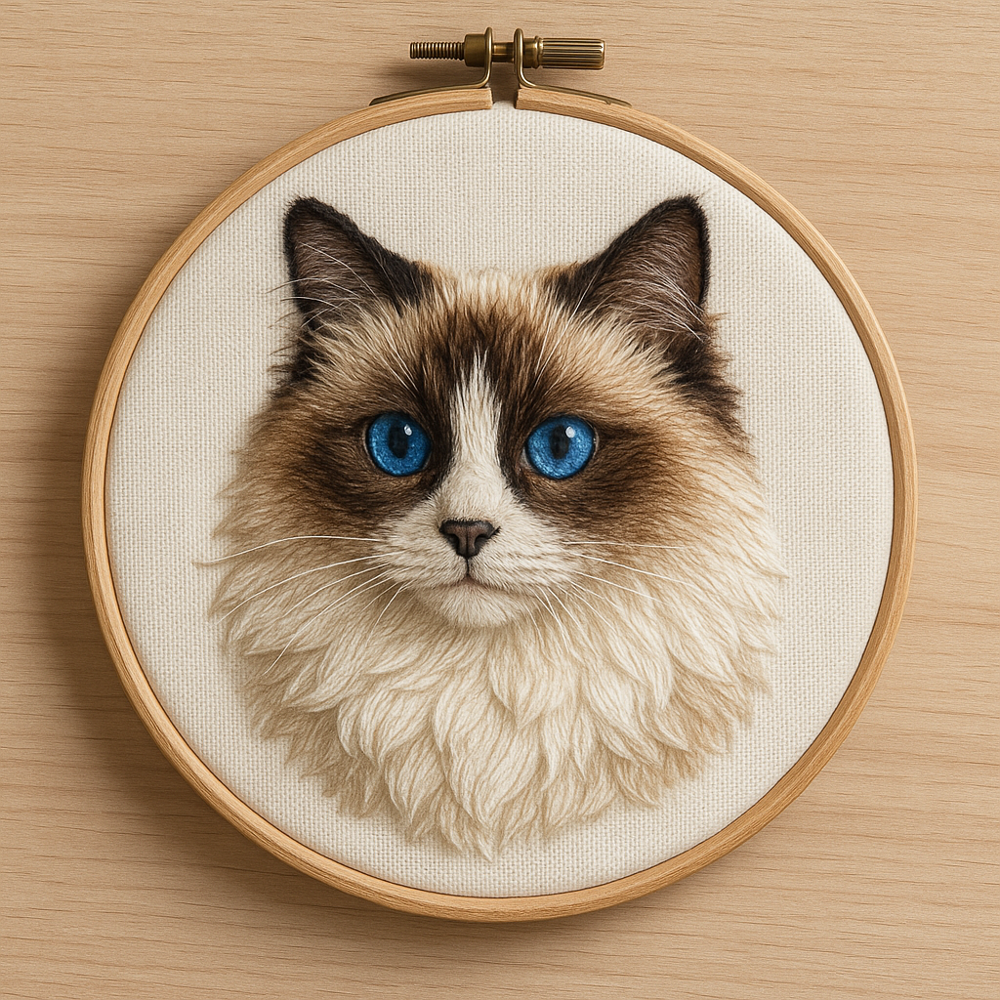

Shells

> "Your effort to remain what you are is what limits you." — the Puppet Master, *Ghost in the Shell* (1995)

The Puppet Master says this to Kusanagi as a challenge to hold onto a fixed self in a world where bodies, voices, and identities can all be manufactured — but the line works just as well turned outward, toward the communities we're about to go looking through. Every hobby group, fandom, and marketplace that polices what counts as a "real" photo, a "real" handmade object, a "real" review, is doing its own version of that same effort: drawing a line around what it is, and bracing against a flood of generated content that doesn't respect the line. This week we go looking for the shells already circulating in the wild — the AI-generated images already moving through the communities you belong to — and ask what it costs a community to keep insisting on what's real.

## Tutorial: Images as Information

We've been working a lot with the creation and analysis of AI-generated images in controlled environments. Now, as we prepare to shift our attention from images to code, we're going to investigate how AI imagery is already present and circulating in online communities and social spaces. This week focuses on developing your ability to identify AI-generated content "in the wild" and understanding how these images are already changing the information landscape.

### Choosing Your Investigation Focus

First, select a current topic or hobby that genuinely interests you. This could be anything from home decoration, quilting, embroidery, cooking, gardening, fashion, fitness, art, gaming, or any other area where visual content plays a significant role in community sharing and discussion. The key is to choose something you have some familiarity with, as this will help you better assess what looks "normal" versus potentially artificial in that space.

For example, I spend a lot of time in textile groups, and AI embroidery is everywhere — including in patterns being sold on Etsy. An embroiderer and designer, Anne Marie Oliver, has spoken about the problem both [in an interview](https://egausa.org/anne-marie-oliver-impact-ai-embroidery/) and in [a post designed to help people recognize fake embroidery](https://lolliandgrace.com/blogs/blog/artificial-intelligence-in-the-embroidery-space). Here's an archived 2025 sample of the type of not-achievable embroidery that commonly circulated in these spaces, generated at the time with OpenAI's GPT Image 1 model — since superseded by [GPT Image 2](https://openai.com/index/introducing-chatgpt-images-2-0/), released April 21, 2026:

Consider communities where people regularly share images of their work, purchases, inspiration, or tutorials. Think about spaces where visual authenticity might matter to participants, or where the ease of AI generation might be particularly tempting for content creators.

### Investigating AI Presence in Online Communities

Next, spend time exploring your chosen topic across various social media platforms and online communities. Focus your investigation on platforms like:

- Instagram (hashtags, influencer accounts, community posts)
- Facebook Groups (hobby groups, buying/selling groups, advice communities)
- Pinterest (inspiration boards, DIY content)
- Reddit (relevant subreddits)
- TikTok (tutorial videos, showcases)
- Specialized forums or websites for your chosen interest

As you browse, look for images that strike you as potentially AI-generated. Images are not as obvious as they used to be, so consider how AI might be specifically used (or misused) in your chosen community. Are people using AI to create inspiration images? To fake completed projects? To generate tutorial content? To create product mockups? Document at least three images that either clearly appear to be AI-generated or are sparking debate among viewers about their authenticity.

Try using Claude Sonnet 5 (the current release) to analyze the images, asking specifically if it is AI-generated: this imitates the functionality of the AI "detection" tools currently being widely marketed.

### Discussion

Your discussion post should include your three flagged images along with your analysis of each one. Provide context about the community you investigated, what drew you to suspect these images were AI-generated, and any community responses you observed. Connect your findings to this week's readings — Henry Farrell's ["After software eats the world, what comes out the other end?"](https://www.programmablemutter.com/p/after-software-eats-the-world-what) and the two 404 Media investigations, ["Pinterest Is Drowning in a Sea of AI Slop and Auto-Moderation"](https://www.404media.co/pinterest-is-drowning-in-a-sea-of-ai-slop-and-auto-moderation/) and ["Where Facebook's AI Slop Comes From"](https://www.404media.co/where-facebooks-ai-slop-comes-from/) — about current examples of AI usage raising concerns. Consider how your investigation reveals the changing relationship between human creativity, digital tools, and online trust.

Finally, connect this back to the epigraph. The Puppet Master frames "remaining what you are" as a limit, something to be outgrown; the communities you investigated this week are, in effect, arguing the opposite — that remaining recognizably, verifiably what they are (handmade, photographed, lived) is exactly what's worth defending, and that AI slop erodes it. Whose position do you find more persuasive after this investigation, and what does it cost a community — in labor, in trust, in openness to newcomers — to keep policing that line between the generated and the real?
