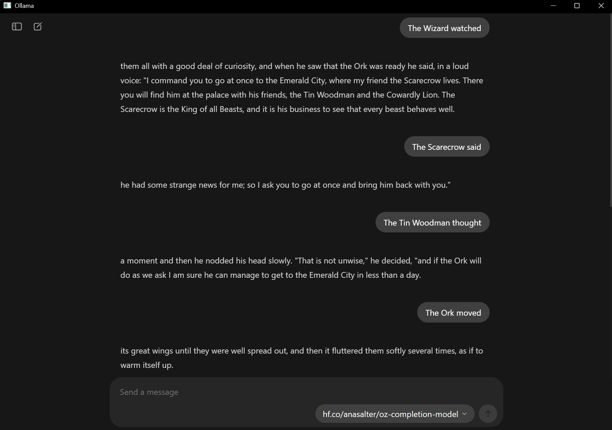

## Exercise: Custom Bots

As we're approaching the end of the semester, this exercise is optional, and there are three options of increasing complexity: I recommend watching through the demo videos first, and deciding which appeals.

### Option One: Claude Skills (Extra Credit up to 6 points)

For this option, you will be working through the main Claude chatbot interface. First, go to settings and make sure you've enabled "skill-creator" under Cababilities->Skills. 

Next, use an initial prompt that starts with "Use the skill-creator skill to help me create a new skill for..."

As with your previous work with Claude, make sure to be as precise as possible. Follow the suggestions in [this discussion of frontend design in Claude](https://www.claude.com/blog/improving-frontend-design-through-skills) and think about areas of frustration you've experienced: you could provide a detailed style guide for writing; a set of preferences for the styling of HTML pages; etc. 

Once Claude creates the skill, it will provide the file as a .zip. Save that and return to the settings page: select "Upload Skill" under settings, and upload your file. Make sure the skill is activated, and return to the chatbot. Prompt your own skill tool using the name listed in "skills," and test some outputs. Did it change the defaults you typically get from Claude? Was your intention realized?

### Option Two: Claude Subagents (Extra Credit up to 6 points)

This option requires Claude Code to be installed on your computer: unfortunately, it takes advantage of capabilities that the web version doesn't have, as the agents and their instructions are stored on your own harddrive. For this exercise, first open your terminal or command line and navigate to an empty folder, then type "claude" to start.

Type "/agents" and press enter to launch the agents interface. Select "Create new agent" and press enter. I recommend adding the agent to "Personal" so that you can make use of it in the future, particularly if you have a concept for some customization that might be useful: for instance, you might build an agent dedicated to fixing the front-end design of the site rather like the skills option above. For examples, check out [this collection of Claude Code subagents](https://github.com/VoltAgent/awesome-claude-code-subagents) and [this collection of quality assurance agent, including "reality check Karen"](https://github.com/darcyegb/ClaudeCodeAgents).

To run the agent in the future, invoke it in the prompts by using the name under which your agent was scored. Iterate and test your results, and consider refining the agent's description (stored on your computer as a Markdown file in the directory you specified). As before, try it out: was your intention realized?

### Option Three: Fine-Tuning (Extra Credit up to 10 points)

Remember, this is totally optional, and it is intended for those who think it looks fun. It is a complicated workflow, and can be frustrating to get to work, but in exchange it gives you control over a model at a next level compared with our previous projects. This workflow also introduces [Hugging Face](https://huggingface.co/), a platform that hosts machine learning models and datasets, making it easier to access and fine-tune pre-trained language models for custom applications. If you want to, you can even push your model to the cloud. 

Recall the Eliza Bot we "spoke" with at the beginning of the class: Eliza's code uses the same fundamental structures as you've been reading about over the last few weeks in *Code to Joy.* Her set of replies is thus fundamentally very limited to what is pre-scripted. We could easily build our own version of Eliza at this stage, but instead of working with an "old-school" bot, we're going to add on by using the skills you've gained with scraping and preparing datasets to fine-tune a basic story generation bot that remixes public domain material.

#### Hugging Face

For this exercise, you'll use a large number of texts: novels work well, and you might consider pulling the same set as you tried for he distant reading exercise. Having already worked with these texts computationally, you now have a sense of their patterns and characteristics, which makes them ideal candidates for fine-tuning a custom model. The process builds directly on your distant reading work - instead of analyzing patterns in the texts, you're now training a model to generate new text that echoes those patterns. Before you begin, you'll need to create a free Hugging Face account and get an access token, then bring that into the notebooks below:

1. **Create an Account**: Go to [Hugging Face](https://huggingface.co/) and sign up for a free account
2. **Generate a Token**: 
   - Click on your profile picture in the top right corner
   - Select "Settings" from the dropdown menu
   - Click on "Access Tokens" in the left sidebar
   - Click "New token" and give it a name (like "Colab Fine-tuning")
   - Set the role to "Write" (this allows you to upload models if you choose)
   - Copy the generated token
3. **Add to Colab Secrets**:
   - In your Google Colab notebook, click the key icon (🔑) in the left sidebar
   - Click "Add new secret"
   - Name it `HF_TOKEN`
   - Paste your Hugging Face token as the value
   - Make sure to enable notebook access for this secret

This token allows the notebook to access Hugging Face's model hub and optionally upload your fine-tuned model to use through your local Ollama interface.

#### Working with the Notebooks

This exercise uses two separate notebooks for the complete workflow - these notebooks are on Google Colab, and in my video I walk through each step:

**Step 1 - Dataset Building**: [Build Training Dataset](https://colab.research.google.com/drive/1YHkYvyiAGDygPCY2Vdz4PTqcS8s3ZVxL?usp=sharing)

This first notebook will take you through the prep of uploading and processing a set of Project Gutenberg texts and breaking them into story-esque fragments for the dataset. You'll need the Hugging Face token to complete the upload and easily reference the dataset you create from your second notebook. For reference, here's an example of a completed dataset based on Oz books: [Oz Fragments Dataset](https://huggingface.co/datasets/anasalter/oz-fragments). This shows you what your final processed dataset might look like when uploaded to Hugging Face.

**Step 2 - Model Training**: [Fine-Tune Custom Bot](https://colab.research.google.com/drive/1-13FhqtVw2ZUB79cL-SQ59Y-i3QZGfGL?usp=sharing)

This second notebook will fine tune the model: this is a notebook that I've lightly customized from [Unsloth](https://unsloth.ai/), a tool for lowering the time and GPU requirements for training. For reference, here's an example of a completed fine-tuned model based on the Oz dataset: [Oz Completion Model](https://huggingface.co/anasalter/oz-completion-model). This model is ready for use in Ollama and shows you what your final trained model might look like when completed. Here's my simple sample deployed with examples of unfinished sentence prompts and the response:

Work through both notebooks in order - the dataset building notebook prepares the foundation, and the training notebook creates your custom bot. There are some places to test the output directly in the notebook: however, if you want to run the model yourself, you'll need to load up your terminal or command prompt and install your model to Ollama after it is uploaded to Hugging Face. The command to run your model is:

    ollama run hf.co/user_name/model_name

It might take some time to install your model, but after it downloads, you can run it like any other model through the local interface.

### Discussion

Compare this experience to the bot interactions we had at the start of the semester: how has your understanding of, and expectation of, these bots changed? Share the results of whichever experiment you selected.

Remember, this exercise is  extra credit: you can choose to engage part or all of the prompt depending on your goals and current grade. 
