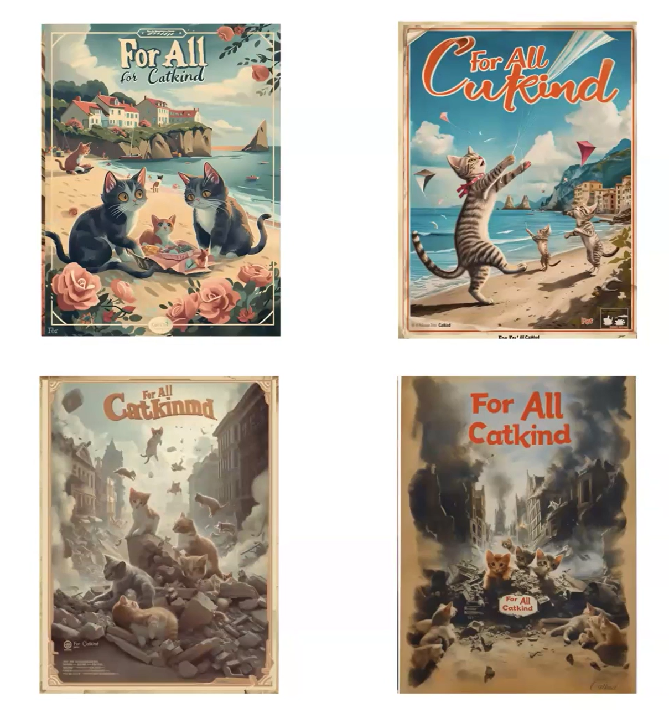

## Tutorial: Image Generation

For this week's exercise, you'll be following the example set by Ian Demsky's ["My Month with Midjourney"](https://electronicbookreview.com/publications/my-month-with-midjourney/) and the examples from the ELO panel “Worlds Remunged: The Pastiche and Parody of Generative AI” with projects by artist-scholars Mark C. Marino, Siobhan O’Flynn (screenshotted below), Alex Mitchell, and Rob Wittig to explore AI image generation through systematic experimentation and critical reflection.  As this week's readings have discussed, generative imagery is particularly contentious, and the availability and ease of use of these tools has serious implications for work and communication broadly. While working through this process, keep in mind Melanie Mitchell's discussions of how the model relates to objects, and iterate your prompting to be as clear and specific as possible.

### Text to Image Experimentation

This week, you'll be creating a series of AI-generated images that explore different aspects and capabilities of generative AI imagery. Your goal is to experiment with various prompting strategies and different AI image generators to understand how these tools interpret language, concepts, and visual styles. Through this process, you'll develop both technical skills in prompt engineering and critical insights into the strengths and limitations of AI image generation.

You will use a combination of [UCF's Copilot subscription (which includes access to image generation)](https://cdl.ucf.edu/faculty-multimedia-center-ai-tools/) and free image generators to create your images. Consider experimenting with multiple platforms to compare results: [Adobe Firefly](https://firefly.adobe.com/generate/image), [Canva](https://www.canva.com/), [Gemini](https://gemini.google.com/), and [Midjourney](https://docs.midjourney.com/hc/en-us/articles/27870399340173-Free-Trials) are options that you might find interesting. If you try more than one generator, consider using the same or similar prompts to see how different models interpret your requests. Following Demsky's methodology, focus on iterative refinement and documentation of your process rather than seeking perfect results immediately.

As you work through this process, experiment with:

- Generating both abstract and realistic images. Think about how words associated with emotions or concepts are interpreted, and what that suggests about the images in the dataset and how these concepts have been tagged by people in the past.
- Generating with and without text. You might find that generating images with embedded text (such as those shown here from Siobhan O'Flynn's "For All Catkind" project) is still experiencing limitations, but each new version of these models continues to improve.
- Providing reference images or using style references (in MidJourney, these are [codes](https://docs.midjourney.com/hc/en-us/articles/32180011136653-Style-Reference)). Just as with our work in text, you can provide reference images to the model using the attachment option. Try using either your own or public domain photos and art to guide the generation toward specific outcomes.
- Testing copyright boundaries. As our readings this week discuss, there are often guardrails on models around the use of copyrighted characters and trademarks - observe how different platforms handle these restrictions.

For each image you create, briefly document your process, including initial attempts, revisions, and unexpected outcomes. Pay particular attention to results that surprise you or reveal something about how these systems represent visual concepts.

### Discussion

After completing this week's readings, share your favorite three AI-generated images and the process / tools that made them. Document both your prompting process and your critical observations about what these tools reveal about visual representation, cultural assumptions, and the boundaries of AI creativity. Remember to include citations to the readings to ground your observations and critique. 
