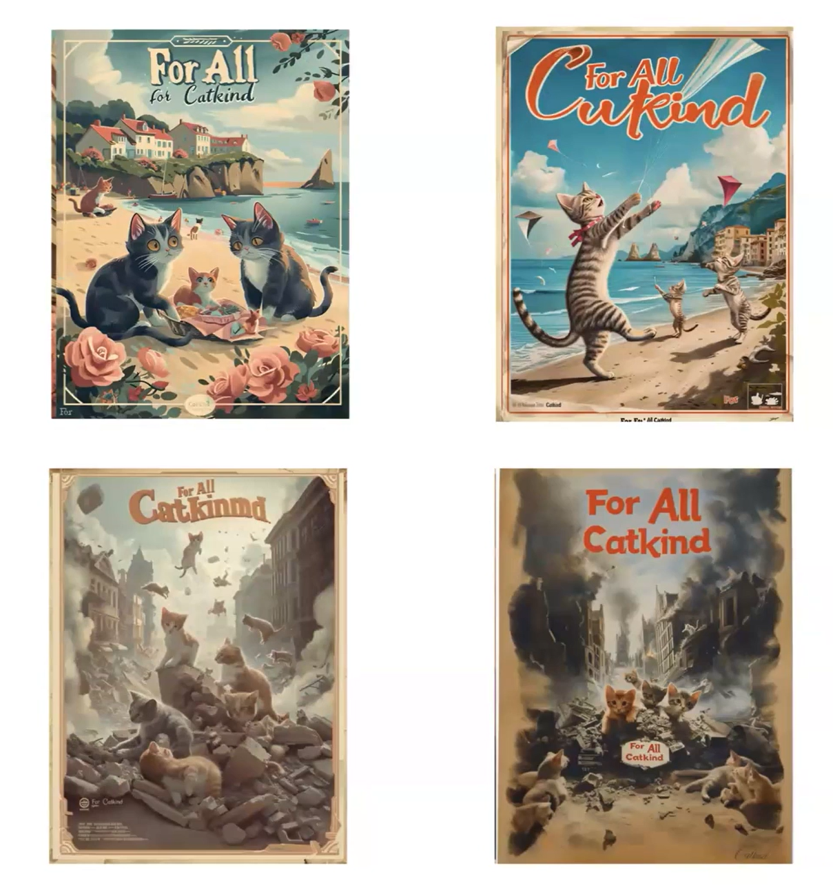

Shells

> “…DNA is nothing more than a program designed to preserve itself.” — the Puppet Master, [*Ghost in the Shell* (1995) script](https://scrapsfromtheloft.com/movies/ghost-in-the-shell-1995-transcript/)

**Slides:** [Week Five slides](slides/weekfive.html)

For four weeks we've been asking what a ghost is: the mind, the voice, the sense that someone is home behind a run of generated text. This week turns the question inside out. If a ghost can be generated, a shell can be too — and if the epigraph can shrug off the line between a body and a program, then the images that stand in for bodies are fair game for generation all the way down. For the next four weeks we're in Shells territory — bodies, surfaces, and the pictures that stand in for them, most of it now produced by systems that can manufacture a face or a figure about as easily as they produce a sentence.

This week's readings add Donna Haraway's "A Cyborg Manifesto" (excerpt) as the theoretical anchor for the whole unit. Haraway's cyborg — "a creature in a post-gender world," unconcerned with clean lines between organism and machine, human and animal, physical and non-physical — gives us sharper language for the shelling sequence than "special effects" does: a manufactured body is not a lesser body, and the boundary-panic the film's world feels about cyborg shells is close to the boundary-panic Haraway argues we would do well to live without. Keep her framework in mind as you generate images this week. Every AI-generated face or figure you produce is its own small shelling sequence: a surface built from data, offered up to be looked at, with no one required to ask whether it deserves a body before it's allowed to look like one.

## Tutorial: Shells and Image Generation

For this week's exercise, you'll be following the example set by Ian Demsky's ["My Month with Midjourney"](https://electronicbookreview.com/publications/my-month-with-midjourney/) and the examples from the ELO panel "Worlds Remunged: The Pastiche and Parody of Generative AI," with projects by artist-scholars Mark C. Marino, Siobhan O'Flynn (screenshotted below), Alex Mitchell, and Rob Wittig, to explore AI image generation through systematic experimentation and critical reflection. As this week's readings discuss, generative imagery is particularly contentious, and the availability and ease of use of these tools has serious implications for work and communication broadly. While working through this process, keep in mind Melanie Mitchell's discussions of how a model relates to objects, and iterate your prompting to be as clear and specific as possible.

### Text to Image Experimentation

This week, you'll be creating a series of AI-generated images that explore different aspects and capabilities of generative AI imagery. Your goal is to experiment with various prompting strategies and different AI image generators to understand how these tools interpret language, concepts, and visual styles. Through this process, you'll develop both technical skills in prompt engineering and critical insights into the strengths and limitations of AI image generation.

You will use a combination of [UCF's Copilot subscription (which includes access to image generation)](https://cdl.ucf.edu/faculty-multimedia-center-ai-tools/) and free image generators to create your images. Consider experimenting with multiple platforms to compare results: [Adobe Firefly](https://firefly.adobe.com/generate/image), [Canva](https://www.canva.com/), and [Midjourney](https://docs.midjourney.com/hc/en-us/articles/27870399340173-Free-Trials) remain solid options. [Gemini](https://gemini.google.com/) is also worth trying, but note that Google's much-touted free year of Gemini for students has expired — the [current student offer](https://support.google.com/gemini/answer/16417758) is a one-month free trial of Google AI Pro, US-only, requiring SheerID student verification (with a discounted student rate otherwise), so verify the current terms before you count on it for this exercise. If you try more than one generator, consider using the same or similar prompts to see how different models interpret your requests. Following Demsky's methodology, focus on iterative refinement and documentation of your process rather than seeking perfect results immediately.

As you work through this process, experiment with:

- Generating both abstract and realistic images. Think about how words associated with emotions or concepts are interpreted, and what that suggests about the images in the dataset and how these concepts have been tagged by people in the past.
- Generating with and without text. You might find that generating images with embedded text (such as those shown here from Siobhan O'Flynn's "For All Catkind" project) is still experiencing limitations, but each new version of these models continues to improve.
- Providing reference images or using style references (in Midjourney, these are [codes](https://docs.midjourney.com/hc/en-us/articles/32180011136653-Style-Reference)). Just as with our work in text, you can provide reference images to the model using the attachment option. Try using either your own or public domain photos and art to guide the generation toward specific outcomes.
- Testing copyright boundaries. As our readings this week discuss, there are often guardrails on models around the use of copyrighted characters and trademarks — observe how different platforms handle these restrictions.

For each image you create, briefly document your process, including initial attempts, revisions, and unexpected outcomes. Pay particular attention to results that surprise you or reveal something about how these systems represent visual concepts.

### Discussion

After completing this week's readings, share your favorite three AI-generated images and the process / tools that made them. Document both your prompting process and your critical observations about what these tools reveal about visual representation, cultural assumptions, and the boundaries of AI creativity. Remember to include citations to the readings to ground your observations and critique.

Finally, put Haraway's cyborg in conversation with Demsky's account of prompting Midjourney toward images he could live with: does treating a generated body as a Haraway-style cyborg change how responsible you feel for what it looks like? (The epigraph's shrug — a body is just a self-preserving program — is one available answer; you don't have to accept it.)
