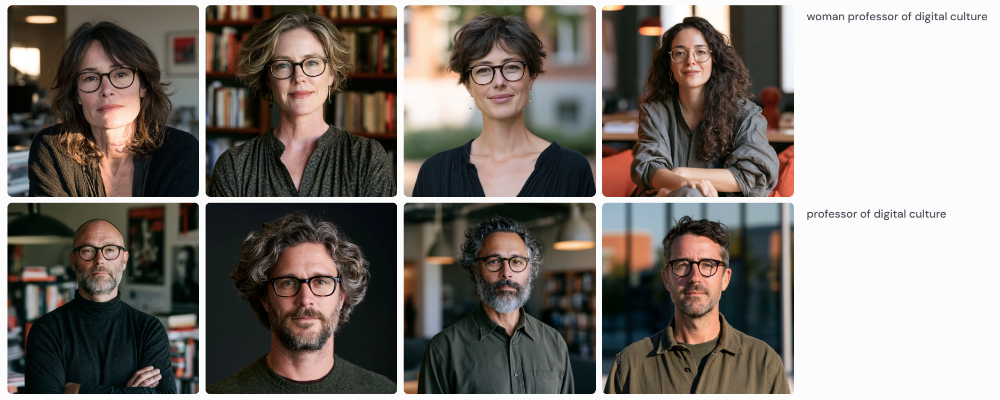

Shells

> “…DNA is nothing more than a program designed to preserve itself.” — the Puppet Master, [*Ghost in the Shell* (1995) script](https://scrapsfromtheloft.com/movies/ghost-in-the-shell-1995-transcript/)

For four weeks we've been asking what a ghost is: the mind, the voice, the illusion that someone is home behind a run of generated text. This week turns the question inside out. If a ghost can be generated, a shell can be too. For the next four weeks we're in shells territory, looking at images that can have significant consequences for our understanding of what is art, and what is real.

This week's readings turn from the bodies on screen to the stories told about the systems that make them. In her *WIRED* interview with Lauren Goode, Timnit Gebru argues that the "machine-god narrative" — AI as a looming extinction-level threat — is "meant to distract us" from harms that are already here, from weapons systems operating without human control to the ordinary question of who is accountable when these tools do damage now. Melanie Mitchell's "Misleading Metaphors and Real Risks" reminds us that when agents are described as "going rogue," "escaping," or "scheming," the metaphor hides a far more mundane account of weak sandboxing, thin oversight, and reinforcement learning that rewards persistence and reward hacking. Keep both in mind as you generate images this week. Every AI-generated face or figure you produce is its own small shelling sequence: a surface built from data, offered up to be looked at, and the language we reach for to describe where it came from ("the model imagined," "the AI decided") is exactly the kind of metaphor Mitchell asks us to reconsider.

## Tutorial: Shells and Image Generation

For this week's exercise, you'll be following the example set by Ian Demsky's ["My Month with Midjourney"](https://electronicbookreview.com/publications/my-month-with-midjourney/) to explore AI image generation through systematic experimentation and critical reflection. As this week's readings discuss, generative imagery is particularly (and understandably!) contentious, and the availability and ease of use of these tools has serious implications for work and communication broadly. While working through this process, keep in mind Melanie Mitchell's discussions of how a model relates to objects, and iterate your prompting to be as clear and specific as possible.

### Text to Image Experimentation

This week, you'll be creating a series of AI-generated images that explore different aspects and capabilities of generative AI imagery. Your goal is to work through four types of prompts, adapting each to your own interests, to understand how these tools interpret language, concepts, and visual styles. The exercise is intended to be pretty light: it's really to get us all on the same page about where image generation is, the same way we got on the same page about text generation when we started that unit. I recommend watching my exercise video, which demos the full sequence of prompts across Gemini, ChatGPT, and Midjourney, before you begin.

If you don't want to make accounts on any of the commercial AI tools, you can use [UCF's Copilot subscription (which includes access to image generation)](https://cdl.ucf.edu/faculty-multimedia-center-ai-tools/). Just know that it's a little behind, so your images might not have the same fidelity — particularly when it comes to text — as some of the work you'll see in the discussion. If you're already subscribed to ChatGPT as your main tool this semester, you can use its most powerful image model right away. If you are really interested in understanding the impact of these tools on copyright, consider [Midjourney](https://www.midjourney.com/): it's $10 for one month, as long as you remember to cancel when we're done with the image unit. If you have a Google account, [Gemini](https://gemini.google.com/) will do some image generation for free. If you have access to more than one generator, consider using the same or similar prompts to see how different models interpret your requests. Following Demsky's methodology, focus on iterative refinement and documentation of your process rather than seeking perfect results immediately.

Work through each of these four types of prompts:

1. **A general identity.** Think about your field or your professional identity and ask for an illustration of it, starting with really broad terms. Mine is "professor of digital culture." Look closely at the choices the model makes around race, gender, age, clothing, and setting, and at the fidelity of the result: could you tell this was an AI image if it turned up in a stock photo library or a search result? From there, try the old "make it more" trick (make it more professor, make it more tech) to push at the dataset and see which details the model treats as making up that identity.
2. **Specific identity markers.** Add an identity marker to the same prompt and notice what changed and what didn't. My Midjourney results for "professor of digital culture" and "woman professor of digital culture" are below: everyone apparently shops at the same glasses store, and the similarities around age, race, and even facial expression say a great deal about the dataset. In a chat-based tool, start a new chat first, or the model will keep modifying your previous image.
3. **Copyright boundaries.** Pick a copyrighted property and ask for your subject as part of it (mine was "illustrate a professor as a member of the X-Men"). This prompt shouldn't work, and depending upon your image generator and the property you pick, it may or may not. As our readings this week discuss, there are often guardrails on models around the use of copyrighted characters and trademarks — observe how different platforms handle these restrictions, then try a generic version ("a professor who leads a superhero team") and compare.
4. **A reference image.** Just as with our work in text, you can provide reference images to the model using the attachment option. Upload a photo and ask the model to transform it — I used the one that has been making the rounds, "make this professional," deliberately, because it has so much embedded in it linguistically. Feel free to use a photo of your cat, a stock photo that's already online, or a public domain image if you don't want to provide your own image. Think about how the image relates to the prompt and what you expect to happen given the norms you're invoking, and use the result to get a sense of how easily reality can be manipulated.

For each image you create, briefly document your process, including initial attempts, revisions, and unexpected outcomes. Pay particular attention to results that surprise you or reveal something about how these systems represent visual concepts.

### Discussion

After completing this week's readings, share at least one AI-generated image for each of the four types of prompts, along with the process / tools that made them and a discussion of the exercise and your findings. Each of the four prompt types is worth 1 point. If you cannot get past the copyright guardrails, share your work for that prompt anyway and talk about what happened, because some of the tools will make it much more difficult. Document both your prompting process and your critical observations about what these tools reveal about visual representation, cultural assumptions, and the boundaries of AI creativity. Remember to include citations to the readings to ground your observations and critique.

Finally, put Gebru and Mitchell in conversation with your own images. Both argue that the loudest stories about AI — extinction-level doom, agents "going rogue" — pull attention away from present harms and explicable mechanisms. What is the equivalent distraction in image generation? When a generator hands you a face or a body, which framing (a creative "imagination," a tool with a training set, a self-preserving program as in the epigraph) makes the people responsible for it easiest to see, and which makes them disappear?

The remaining 2 points are for the discussion itself: don't forget to reply twice to peers (1 point / reply) for full credit!
