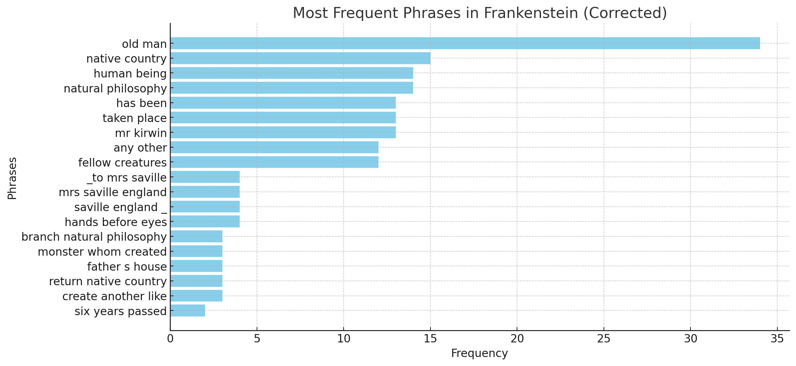
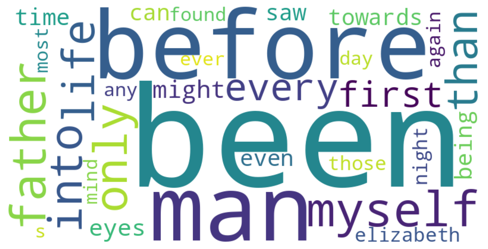
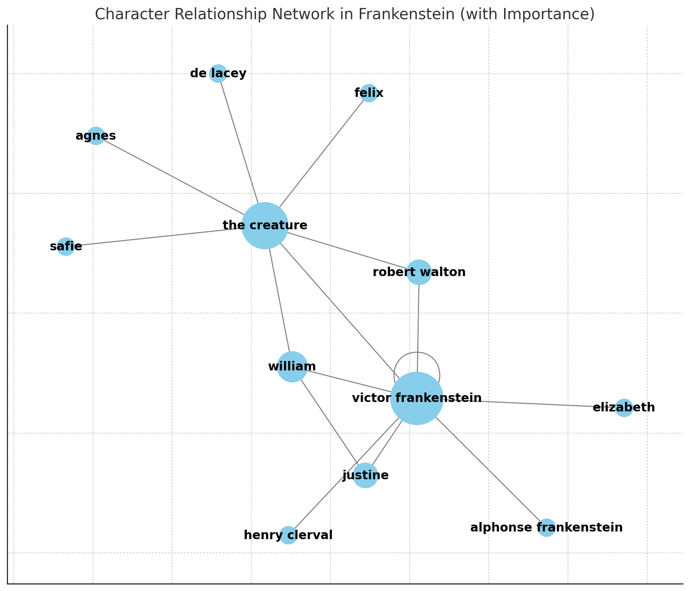

Ghosts

> “…memory cannot be defined. But it defines mankind.” — the Puppet Master, [*Ghost in the Shell* (1995) script](https://scrapsfromtheloft.com/movies/ghost-in-the-shell-1995-transcript/)

**Slides:** [Week Four slides](slides/weekfour.html)

This week we turn from generating text to reading it at scale, using Claude not as a conversational partner but as a research assistant that can process an entire text file at once and surface patterns close reading alone wouldn't catch. Keep the epigraph in mind as you work: a model's reading of a text is a kind of memory — the shape of everything it has read before, and, just as tellingly, what it hasn't.

## Tutorial: Reading Across Texts

This week, we're going to go further in our interactions with prompt-based systems by providing them with new data. For this exercise, you're going to choose at least one text to analyze through distant reading using your Claude subscription, starting with my prompts and working towards developing and iterating your own questions. I recommend using Claude Opus 4.8 for this exercise, as it handles large text files and data analysis particularly well. Depending on the text length, you might find that you need to work in sections or iterate your approach: keep refining until you are happy with your results.

### AI-Assisted Distant Read

Start by selecting a work from [Project Gutenberg](https://www.gutenberg.org/) (anything other than *Frankenstein*, as I'm using that here as a sample), and make sure you download the "Plain Text UTF-8" version as a .txt file. For instance, the plain text version of *Frankenstein* is the file here: [TXT](https://www.gutenberg.org/cache/epub/41445/pg41445.txt). You'll notice that this plain text version has some noise at the top of the file, and at the end — this is information and metadata added by Project Gutenberg. We could delete that ourselves, but we're going to try out Claude's preprocessing capabilities and have it work with us throughout the entire process. So, download that plain text file for now and have it ready to upload to Claude when you're in conversation with the system.

Here's a guiding set of basic prompts to try — these are general, and it might require several iterations to get the output of each:

- I'd like to do some distant reading analysis of a novel. Can you help me through the process?
- I've attached the Project Gutenberg version of our text. Let's start by pre-processing it for analysis.
- Can you generate a bag of words?
- Many of these are common words, can you apply a basic stopwords to remove things like I, the, do, is, our, etc? (more likely to need this for Sonnet)
- Can you visualize the top words as a word cloud?
- Using the bag of words and the cleaned text, could you make some determinations about the genre of this work and the themes?
- Can you visualize the network of character relationships in this text?
- Can you visualize the most frequent phrases?

This is an area where we can see significant improvement in the visualizations themselves over different models of generative AI. Here's a few examples from an earlier run of this exercise, generated with ChatGPT, to compare:

*Figure 1. Frequent bigrams and trigrams*

*Figure 2. Word cloud, after iterating stop words*

*Figure 3. Character network, weighting for significance*

And here's archived output generated with Claude Opus 4.1 (2025), linked as artifacts — a sample from last year's version of this exercise. For your own work this term, use the current Claude Opus 4.8:

- [Word Cloud](https://claude.ai/public/artifacts/16c6479e-19e5-41fd-9cdf-a1a9562a4fda)
- [Character Network Visualization](https://claude.ai/public/artifacts/3341474e-aea1-4f7b-8b1a-1fa1e6a57fdf)

Use Ted Underwood's "A Genealogy of Distant Reading" to guide your process and question development, and hold onto Underwood's more recent piece with David Bamman and Noah A. Smith, "The Literary Canons of Large-Language Models," as you go — it's a useful check on what you're about to do. Their argument is that LLMs have absorbed a canon of their own, shaped by whatever got digitized, scraped, and repeated most often across their training data, and that this canon is uneven in ways that are easy to miss if you only look at the output. As Claude helps you analyze your chosen text, watch for moments where its analysis leans on assumptions about "the novel" or "character" or "genre" that come from a narrow, canon-shaped sense of what literature looks like, rather than from your specific text.

You might find it easiest to analyze a text that's in an area that you're familiar with, or that is in an area of interest to you, so that you will have a better capacity to check and verify the output. Critique the quality of results you're getting, particularly in terms of their potential usefulness for this type of research.

If you'd like to venture further, you can also do some comparative analysis of texts. But for this week, we're just aiming to develop a better understanding of distant reading with the assistance of generative AI. You'll notice that Claude might suggest creating code artifacts or more sophisticated analysis tools to get better results. If you have experience in programming and you're interested in working that way with Claude now, you certainly can start to pursue that path. But right now, it is not necessary for completing the assignment.

### Discussion

After completing our readings, iterate on a distant read of your selected text from Project Gutenberg using your Claude subscription. Consider the examples I provided in the tutorial to get started and experiment with other approaches to textual analysis using your original prompts. Share the results of your textual analysis in the discussion post, with citations to this week's readings and links to your artifacts or screenshots of the visualizations to ground your decisions and critique.

Bring the Bamman, Underwood, and Smith piece directly into your reflection: where, if anywhere, did you notice your model's assumptions skewing toward a narrower literary canon than the text you actually chose deserved? Did that skew show up in the bag of words, the character network, the genre guess — or did you not notice it until you went looking?

Finally, one glance back at the epigraph: whose memory is in the room when you look at your word cloud or character network — yours, the author's, or the model's?
