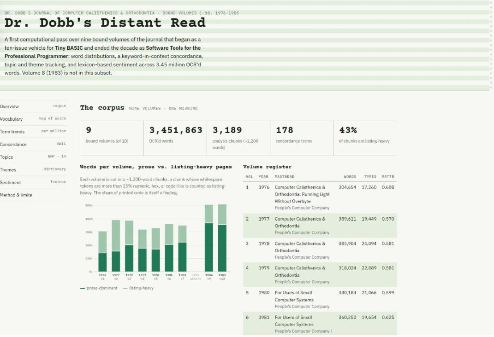
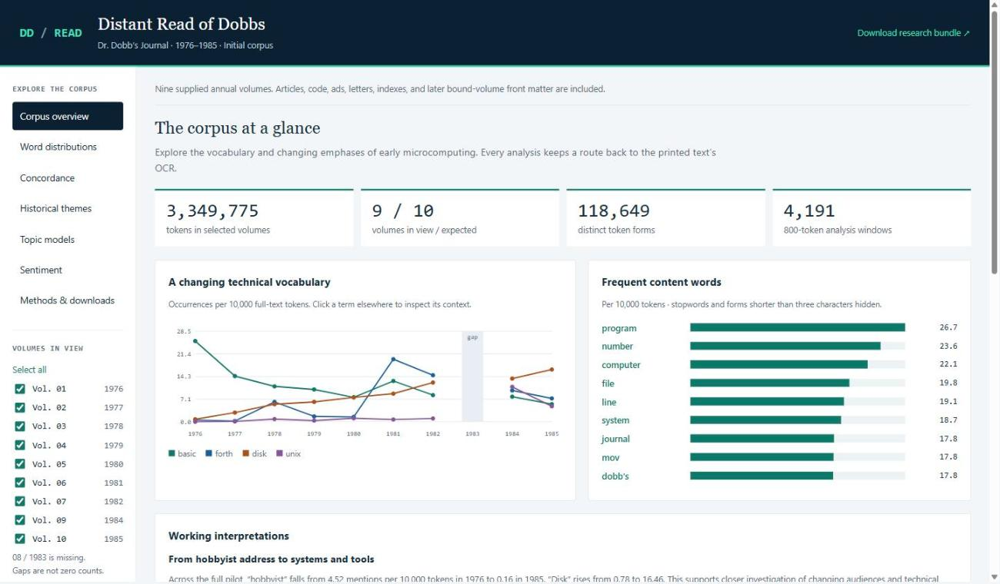
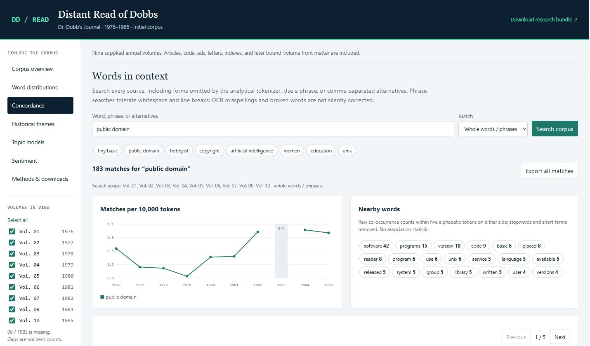

Ghosts

> “…memory cannot be defined. But it defines mankind.” — the Puppet Master, [*Ghost in the Shell* (1995) script](https://scrapsfromtheloft.com/movies/ghost-in-the-shell-1995-transcript/)

This week we turn from generating text to reading it at scale, using Claude or ChatGPT not as a conversational partner but as a research assistant that can process a whole folder of texts at once and surface patterns close reading alone wouldn't catch. Keep the epigraph in mind as you work: a model's reading of a text is a kind of memory — the shape of everything it has read before, and, just as tellingly, what it hasn't.

## Tutorial: Reading Across Texts

This week, we're going to go further in our interactions with prompt-based systems by providing them with new data. For this exercise, you're going to choose 5-10 texts to analyze comparatively through distant reading, working in a project in either Claude's Cowork or ChatGPT's Work mode, starting with my prompts and working towards developing your own questions. Use Claude (Opus 5 or Fable 5.1, as available to you) or ChatGPT (GPT-6 Astra recommended, but not required): both handle large text files and data analysis well, and with your texts set up in a project folder you shouldn't need to work in sections or run several iterations to get output from each prompt. Keep refining your questions until you are happy with your results.

### AI-Assisted Distant Read

Start by selecting 5-10 texts: novels, short stories, magazines, or other texts relevant to your interests. There are two recommended sources, and both give you plain text files that the models can work with directly:

- [Project Gutenberg](https://www.gutenberg.org/) is the easiest source for literary texts. Make sure you download the "Plain Text UTF-8" version of each as a .txt file. For instance, the plain text version of *Frankenstein* is the file here: [TXT](https://www.gutenberg.org/cache/epub/41445/pg41445.txt).
- The [Internet Archive](https://archive.org/) is the best source for periodicals and out-of-copyright nonfiction. Browse the [book collection](https://archive.org/details/texts), [The Magazine Rack](https://archive.org/details/magazine_rack), or a narrower set such as [Computer Magazines](https://archive.org/details/computermagazines); on any item's page, look under "Download Options" and choose the **Full Text** (.txt) file rather than the PDF. My sample this week uses ten bound volumes from the archive's [Dr. Dobb's Journal](https://archive.org/details/dr_dobbs_journal) collection, so pick something other than that.

Put all of your .txt files together in one folder. You'll notice that these plain text versions have some noise: Project Gutenberg adds header and footer metadata to every file, and the Internet Archive's texts are OCR output, with the misspellings and broken words that come with scanning. We could clean that ourselves, but we're going to try out the model's preprocessing capabilities and have it work with us throughout the entire process. So, gather your plain text files into a folder for now, then set up a project in Cowork or Work pointed at that folder (as shown in the video and screenshots) before you start prompting.

Here's the prompt I used to generate the sample outputs below, working from a folder of Dr. Dobb's volumes. I ran it twice, once with Claude Fable 5.1 and once with ChatGPT's GPT-6 Astra, and both sets of results are linked below. For your own work, use either Claude or ChatGPT with whichever model you have access to: the prompt works the same way in both.

> I'm conducting a distant read of Dobbs journal. This is a subset for an initial pass. Let's analyze the full text distribution using a bag of words, create a concordance for exploring important topics in this period of computer history, break down the themes, sentiment analysis, and topics across the ten journals, and build an interactive visual interface for exploring across the set.

That one prompt does a lot of work at once, and the models can handle it. But you'll get more out of the exercise if you also break the process into steps and interrogate each one. Here's a guiding set of basic prompts to try — these are general, and you should adapt them to your set of texts:

- I'd like to do some comparative distant reading analysis of the texts in this folder. Can you help me through the process?
- These are Project Gutenberg versions of the texts. Let's start by pre-processing them for analysis, stripping the header and footer metadata from each.
- Can you generate a bag of words for each text?
- Many of these are common words, can you apply a basic stopwords to remove things like I, the, do, is, our, etc?
- Can you visualize the top words as a word cloud for each text, and one for the set as a whole?
- Using the bags of words and the cleaned texts, could you make some determinations about the genre and themes of each work, and where they overlap?
- Can you visualize the network of character relationships in each text? Are there structural similarities across them?
- Can you visualize the most frequent phrases across the set, and which are distinctive to a single text?
- Which of these texts is the outlier, and what makes it one?

This is an area where we can see significant improvement in the visualizations themselves over different models of generative AI. Here are the two sample outputs from my Dr. Dobb's prompt, one from each platform, to compare. Both are live, so click through and explore them. These were generated with the top-tier models on each platform, but the same prompts will work with whichever Claude or ChatGPT model you have access to, and it's worth noting how your results differ:

- [Dr. Dobb's Distant Read](https://claude.ai/code/artifact/62b1c96b-749f-4efc-8d03-27479626517e), generated with Claude Fable 5.1
- [Distant Read of Dobbs: Corpus Explorer](https://dobbs-distant-read.profwho.chatgpt.site/), generated with ChatGPT (GPT-6 Astra)

*Figure 1. Claude's interface: corpus overview, with prose vs. listing-heavy pages per volume*

*Figure 2. ChatGPT's interface: term trends across the decade and frequent content words*

*Figure 3. ChatGPT's concordance: keyword-in-context search for "public domain" across the volumes*

Notice that the two models made different decisions from the same prompt: about how to chunk the texts, what to count, which volume is missing and how to flag it, and how much of the printed code to treat as noise versus evidence. Those decisions are part of what you're evaluating.

Use Ted Underwood's "A Genealogy of Distant Reading" to guide your process and question development, and hold onto Underwood's more recent piece with David Bamman and Noah A. Smith, "The Literary Canons of Large-Language Models," as you go — it's a useful check on what you're about to do. Their argument is that LLMs have absorbed a canon of their own, shaped by whatever got digitized, scraped, and repeated most often across their training data, and that this canon is uneven in ways that are easy to miss if you only look at the output. As the model helps you analyze your chosen texts, watch for moments where its analysis leans on assumptions about "the novel" or "character" or "genre" that come from a narrow, canon-shaped sense of what literature looks like, rather than from your specific texts. This matters even more when you're comparing several texts at once: the model's sense of which of your texts is "typical" and which is the outlier is itself a canon judgment.

You might find it easiest to analyze texts that are in an area that you're familiar with, or that are in an area of interest to you, so that you will have a better capacity to check and verify the output. Critique the quality of results you're getting, particularly in terms of their potential usefulness for this type of research.

Comparative analysis is the point this week: aim for claims about the set that you couldn't have made from reading any one text alone, and check them against what you know of the texts. You'll notice that the model might suggest creating code artifacts or more sophisticated analysis tools to get better results. If you have experience in programming and you're interested in working that way now, you certainly can start to pursue that path. But right now, it is not necessary for completing the assignment.

### Discussion

After completing our readings, iterate on a comparative distant read of your selected texts using Claude or ChatGPT. Consider the examples I provided in the tutorial to get started and experiment with other approaches to textual analysis using your original prompts. Share the results of your textual analysis in the discussion post, with citations to this week's readings and links to your artifacts or screenshots of the visualizations to ground your decisions and critique.

Bring the Bamman, Underwood, and Smith piece directly into your reflection: where, if anywhere, did you notice your model's assumptions skewing toward a narrower literary canon than the texts you actually chose deserved? Did that skew show up in the bags of words, the character networks, the genre guesses, the choice of outlier — or did you not notice it until you went looking?

Finally, one glance back at the epigraph: whose memory is in the room when you look at your word clouds or character networks — yours, the authors', or the model's?

Don't forget to reply twice to peers (1 point / reply) for full credit!
