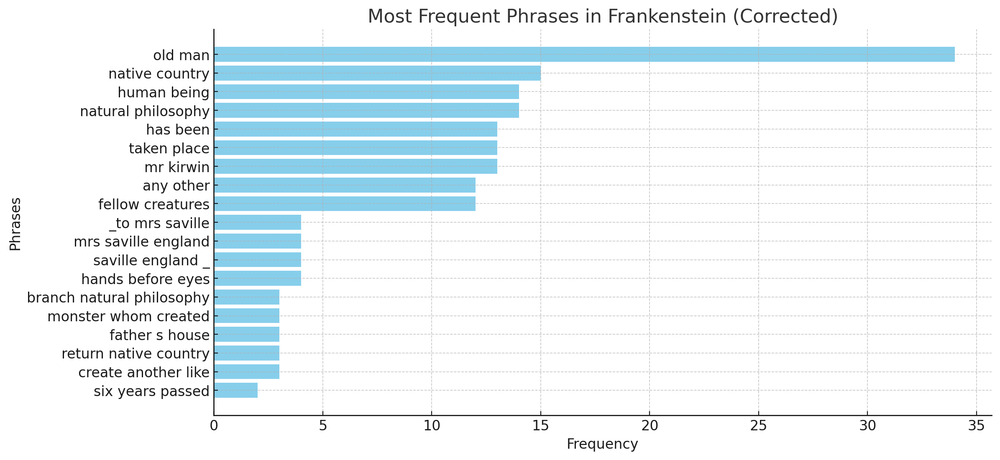
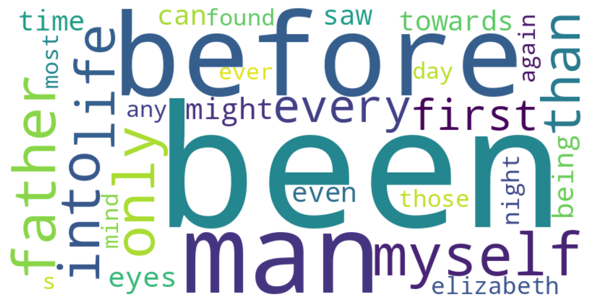
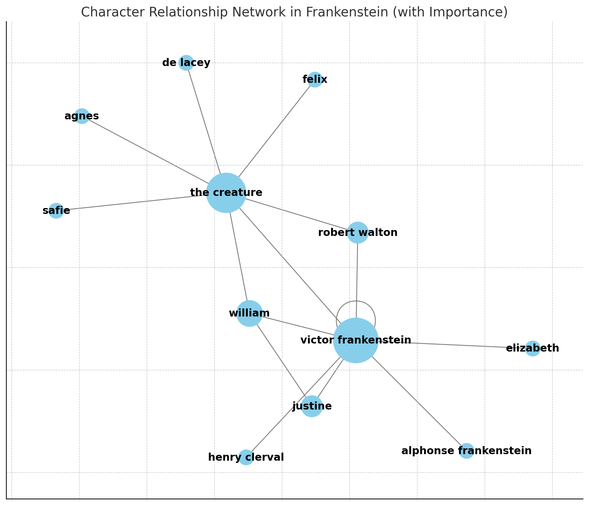

## Tutorial: Reading Across Texts

This week, we're going to go further in our interactions with prompt-based systems by providing them with new data. For this exercise, you're going to choose at least one text to analyze through distant reading using your Claude.AI subscription, starting with my prompts and working towards developing and iterating your own questions. I recommend using Claude Opus 4 for this exercise, as it handles large text files and data analysis particularly well. Depending on the text length, you might find that you need to work in sections or iterate your approach: keep refining until you are happy with your results.

### AI-Assisted Distant Read

Start by selecting a work from [Project Gutenberg](https://www.gutenberg.org/) (anything other than *Frankenstein*, as I'm using that here as a sample), and make sure you download the "Plain Text UTF-8" version as a .txt file. For instance, the plain text version of *Frankenstein* is the file here: [TXT](https://www.gutenberg.org/cache/epub/41445/pg41445.txt). You'll notice that this plain text version has some noise at the top of the file, and at the end – this is information and metadata added by Project Gutenberg. We could delete that ourselves, but we're going to try out Claude's preprocessing capabilities and have it work with us throughout the entire process. So, download that plain text file for now and have it ready to upload to Claude when you're in conversation with the system.

Here's a guiding set of basic prompts to try - these are general, and it might require several iterations to get the output of each:

- I'd like to do some distant reading analysis of a novel. Can you help me through the process?
- I've attached the Project Gutenberg version of our text. Let's start by pre-processing it for analysis.
- Can you provide me the pre-processed text as a file to confirm?
- Can you generate a bag of words for our next steps?
- Many of these are common words, can you apply a basic stopwords to remove things like I, the, do, is, our, etc?
- Can you visualize the top 30 words as a word cloud?
- Using the bag of words and the cleaned text, could you make some determinations about the genre of this work and the themes?
- Can you visualize the network of character relationships in this text?
- Can you pull the most frequently recurring phrases?
- Can you visualize the most frequent phrases?

These basic steps will result in errors, but they can also provide some useful rapid visualizations and data. Here's a few examples from my output - you'll notice that the charts in some cases mention they are corrected because I had to ask for several iterations:

*Figure 1. Frequent bigrams and trigrams*

*Figure 2. Word cloud, after iterating stop words*

*Figure 3. Character network, weighting for significance*

Use Ted Underwood's article on distant reading from this week's readings to guide your process and question development. You might find it easiest to analyze a text that's in an area that you're familiar with, or that is in an area of interest to you, so that you will have a better capacity to check and verify the output. Critique the quality of results you're getting, particularly in terms of their potential usefulness for this type of research.

If you'd like to venture further, you can also do some comparative analysis of texts. But for this week, we're just aiming to develop a better understanding of distant reading with the assistance of generative AI. You'll notice that Claude might suggest creating code artifacts or more sophisticated analysis tools to get better results. If you have experience in programming and you're interested in working that way with Claude now, you certainly can start to pursue that path. But right now, it is not necessary for completing the assignment.

### Discussion

After completing our readings, iterate on a distant read of your selected text from Project Gutenberg using your Claude.AI subscription. Consider the examples I provided in the tutorial to get started and experiment with other approaches to textual analysis using your original prompts. Share the results of your textual analysis in the discussion post, with citations to this week's readings to ground your decisions and critique. 