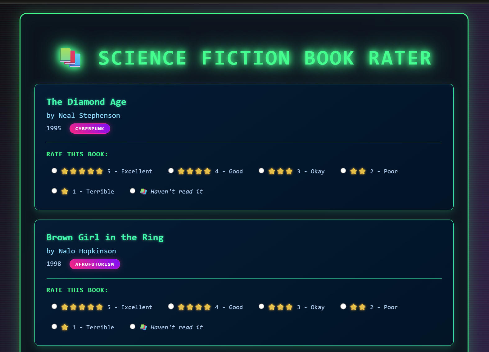

## Exercise: Distant Coding

This week we'll be building on the *Code to Joy* discussions to think about what "programming" loks like when using natural language input of a text prompt interface to develop code. You'll be building a simple, structured dataset, then deploying it as part of a simple website using Claude's artifact feature. You should not need to edit any code directly - instead, you'll be following my prompt model and rewriting it to, as Julia Evans describes in ["So You Want to be a Wizard"](https://wizardzines.com/zines/wizard/), "take on hard projects" through experimentation.

### Prompts for Making a Simple Recommendation Site

These are the prompts I used to build [the sample project for this week](https://claude.ai/public/artifacts/656622ac-8948-41d8-9f9a-5b9305e0ae65), which offers a very simple, Buzzfeed-esque, recommendation system based on user rankings of science fiction books. The exact prompts I used for every stage, broken down to show the different stages of design, are below.

The Claude artifact feature will make it easier to watch the HTML file evolve as you iterate through the prompts. Your process should produce a complete interactive recommendation or similear system within Claude's artifact viewer, which you can then publish and share.

1.  **Initial Dataset Creation**

    -   *Prompt*: \"Create a list of 100 important works of science
        fiction. Each entry should include the title, author, year, and
        one genre from the following: Afrofuturism, Apocalyptic and
        post-apocalyptic fiction, Biopunk, Cyberpunk, Dying Earth,
        Feminist science fiction, Military science fiction, Social
        science fiction, Space opera, Steampunk.\"

    -   *Suggested Modifications*: Try creating a dataset with different
        genres or media types (e.g., films, games, or TV shows) to
        explore how recommendations change based on the type of content. Be specific in the set of options for genre or an equivalent sorting mechanism, as that will be critical to counting user preferences later.

2.  **Converting the List to JSON**

    -   *Prompt*: \"Take the list of 100 important works of science
        fiction and convert it into a JSON file, structured with each
        book\'s title, author, year, and genre.\"

    -   *Suggested Modifications*: Experiment with using different or potentially more complex categories, but make sure to verify the output in text before doing the conversion to JSON. If you are new to this type of work, I suggest sticking to one simple category.

3.  **Displaying Books for User Rating**

    -   *Prompt*: \"Create an HTML page with embedded script and style that takes the JSON data, selects 10 books at random, and displays them with radio
        buttons for users to rate them from 1 to 5 or select \'Haven\'t
        read it\'.\"

    -   *Suggested Modifications*: Display one book at a time, allowing
        users to decide when to stop. Alternatively, add a feature where
        users can skip books they are not interested in. However, if you add these sorts of features, keep them in mind when asking for the new code.

4.  **Book Recommendations**

    -   *Prompt*: \"After the user submits their ratings, display the
        top three genres based on the ratings they provided and recommend three books - make sure they are ones the user hasn't already rated.\"

    -   *Suggested Modifications*: Instead of just displaying the top
        three genres, visualize the genre preferences using a bar chart
        or pie chart. Try for a more sophisticated method than this initial rating system.

5.  **Setting Display and Style Updates**

    -   *Prompt*: \"Make the page theme retro science fiction-themed,
        with styles and colors appropriate for that vibe.\"

    -   *Suggested Modifications*: Experiment with different visual
        themes that fit your dataset. You could also add
        animations or design features - make it as complicated as you'd like!

### Publishing Your Artifact

Feel free to expand on or iterate away from the simple recommendation system modeled here: as I discuss in this week's demo, our goal is to explore the process of iterating by combining real data and new interface elements to build interactivity through Claude. If you do something that breaks everything, you can always go back to the previous version of the artifact, so it is OK to experiment.

Once you've completed your recommendation system in Claude's artifact viewer, you'll need to publish it so others can interact with it. Share your Claude artifact as we've done before with the mostly static pages.

### Discussion

This week, you'll be sharing the link to your Claude artifact recommendation system, and thinking through the relationship of what you've made to our readings from both *Algorithms of Oppression* and *Code to Joy.* What types of expertise went into each stage of building this interactive object? What assumptions or errors do you see in the dataset you've produced? Consider how this type of simple recommendation system speaks to the larger world of algorithmic influences that both Littman and Noble speak to.
