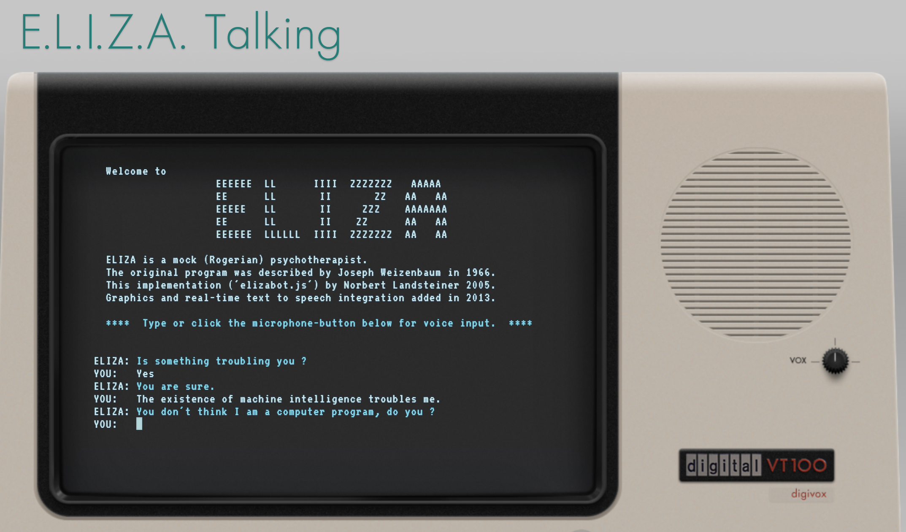

## Tutorial: Eliza and Bots

As this is the first week of class, the goal is to get everyone comfortable with working with the simplest and currently most common interface for generative AI: text prompts, or "chat." ChatGPT has popularized this format and brought it to a wide audience, but bots are a much older concept. You might have encountered them on help websites where they're often a source of frustration in tech support systems and customer service. Those are more obvious bots with the goal of being particularly conversational, whereas ChatGPT and similar interfaces are really just providing you with a context for entering text prompts. Conversational input is actually often not as productive as something more optimized, which we will be talking about as we move forward.

To start us off, I want you to have three experiences that span different eras and approaches to conversational AI. First, with a historic chatbot, Eliza, the program you are introduced to in the critical section of this module in this week's readings. Second, with a modern interface using Claude. Third, with a speculative AI creation that demonstrates how current AI can be prompted to imagine future possibilities. This course requires a subscription to Claude: if you haven't worked with it yet, this is a chance to get used to the interface.

### Conversations, Three Ways

For your first virtual therapist encounter, spend at least 15 minutes interacting with [<<E.L.I.Z.A. Talking>>](https://www.masswerk.at/eliza/). This is one of many iterations on Norbert Landsteiner's version of the original Weizenbaum ELIZA program from our readings: it features a text-to-speech library, which adds to the "chat" capacity of the session. Try talking to ELIZA about topics related to your thoughts after this first week's lecture and readings, and particularly consider asking questions related to the human and the machine (as shown in the screenshot here).

For your second encounter, use [Anthropic Claude](https://claude.ai/), which is required for this course. As noted in the syllabus, you'll need a paid subscription to access the full functionality needed for our assignments. If you haven't already set up your Claude subscription, please do so before completing this exercise.

After loading up Claude, start with a prompt to set the chat to respond similarly to Eliza. I recommend something along the lines of: "For this conversation, please reply as if you are a therapist trained in person-centered or Rogerian therapy, akin to the ELIZA bot." 

As you work with Claude, experiment with different models available in your subscription - try the same prompt with both Claude Sonnet and Claude Opus to see how the responses vary between models. Notice any differences in conversational style, depth of response, or approach to the therapeutic role-playing. 

Again, spend at least 15 minutes, ideally more, conversing with Claude before you go on to the third conversation experience. Screenshot any interesting or surprising moments, and try similar conversations to compare the results between Eliza and Claude. Notice how the level of repetition varies, and which words seem most associated with the responses that you get from each system.

For your third encounter, talk to [**Future ELIZA**](WeekOne/), which was created by prompting Claude Sonnet 4 to build an ELIZA-style chatbot that would "respond like an AI from the future." This demonstration represents how current AI can be directed to speculate about future AI development while maintaining the therapeutic conversation patterns of the original ELIZA.

Spend another 15 minutes conversing with Future ELIZA. As you interact with it, consider: how do you react to the information that this chatbot was generated with a single prompt? What does this resulting bot suggest to you about the future of these technologies?

### Discussion

After experiencing all three conversational AI systems—original ELIZA, modern Claude, and the AI-generated Future ELIZA—share your experience with your peers. Since this is our first week, please include a brief introduction as well as any context in which you've previously worked with generative AI that might be relevant to how you're approaching this semester. 

Note any surprising moments in both encounters and try to draw comparisons between them where you think about this week's lecture and readings which focus us on situating generative AI in a history. A history that we will be developing a better understanding of, especially throughout the first section of this course, even as we engage with very current and rapidly changing generative AI tools. 
