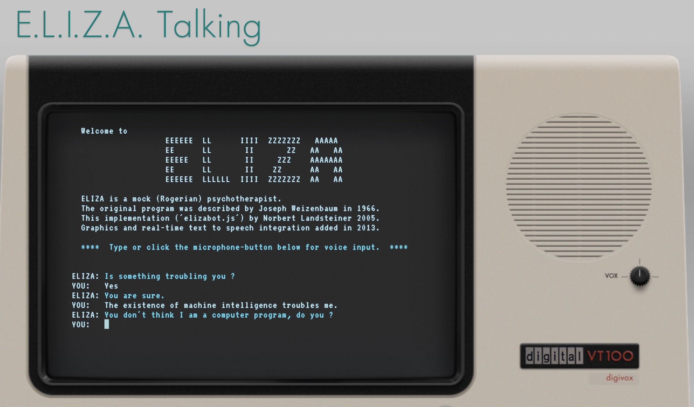

Ghosts

> "There is no program called 'me'." — the Puppet Master, *Ghost in the Shell* (1995)

The Puppet Master makes that claim about itself, but it is really a question about every text-generating system we'll meet this semester, starting with the oldest one: when you talk to ELIZA, or to the assistant on your screen right now, is there anyone behind the words, or only a shell that talks like there is?

## Tutorial: ELIZA and Ghosts

As this is the first week of class, the goal is to get everyone comfortable with working with the simplest and currently most common interface for generative AI: text prompts, or "chat." ChatGPT has popularized this format and brought it to a wide audience, but bots are a much older concept. You might have encountered them on help websites where they're often a source of frustration in tech support systems and customer service. Those are more obvious bots with the goal of being particularly conversational, whereas Claude and similar interfaces are really just providing you with a context for entering text prompts. Conversational input is actually often not as productive as something more optimized, which we will be talking about as we move forward.

This week's readings introduce Weizenbaum's original ELIZA and situate it alongside *Ghost in the Shell* itself — a film turning thirty this year, and the frame for the whole semester. Keep both in mind as you work through the exercise below: one asks what "ghost" means in a machine built to sound like it's listening; the other asks what's left of a person once their mind, memories, and voice can be copied, edited, or generated outright.

## Required Viewing

Before you begin the exercise, watch Mamoru Oshii's *Ghost in the Shell* (1995) if you haven't already, or revisit it if you have.

**Where to watch it (as of August 2026 — check current availability, as streaming rights change):**

- Free with ads on [Tubi](https://tubitv.com/movies/289816/ghost-in-the-shell) and [Plex](https://watch.plex.tv/movie/ghost-in-the-shell)
- Also available via Hoopla (free with a public library card)
- Streaming on [Prime Video](https://www.primevideo.com/detail/Ghost-in-the-Shell/0OJWSCHA0CIJMLUTEBIHLT9ASK), Hulu, and [Netflix](https://www.netflix.com/title/540533)
- Available for rental on Apple TV and Amazon

**What to watch for:** the film gives us a whole vocabulary we'll be reusing all semester — **ghosts** (the mind, the voice, the sense of an "I" behind a body or a text) and **shells** (the bodies, interfaces, and media that carry it). Pay attention to how casually the film's world treats cyborg bodies as replaceable shells, and then watch how that casualness breaks down once the Puppet Master — an entity "born in a sea of information" with no human body at all — starts claiming a ghost of its own. Ask yourself, as you watch: what would have to be true for you to believe it?

**Recommended ongoing viewing:** Science SARU's [*The Ghost in the Shell*](https://www.aboutamazon.com/news/entertainment/ghost-in-the-shell-anime-prime-video) (2026), streaming on Prime Video, is not required, but makes a good running companion throughout the term — new episodes air during the semester, offering an ongoing point of comparison to the 1995 film as we move through the units.

### Conversations, Three Ways

To start us off, I want you to have three experiences that span different eras and approaches to conversational AI. First, with a historic chatbot, ELIZA, the program you are introduced to in this week's readings. Second, with a modern interface using Claude. Third, with a speculative AI creation that demonstrates how current AI can be prompted to imagine future possibilities. This course requires a subscription to Claude: if you haven't worked with it yet, this is a chance to get used to the interface.

For your first virtual therapist encounter, spend at least 15 minutes interacting with [<<E.L.I.Z.A. Talking>>](https://www.masswerk.at/eliza/). This is one of many iterations on Norbert Landsteiner's version of the original Weizenbaum ELIZA program from our readings: it features a text-to-speech library, which adds to the "chat" capacity of the session. Try talking to ELIZA about topics related to your thoughts after this first week's lecture and readings, and particularly consider asking questions related to the human and the machine (as shown in the screenshot here).

For your second encounter, use [Anthropic Claude](https://claude.ai/), which is required for this course. As noted in the syllabus, you'll need a paid subscription to access the full functionality needed for our assignments. If you haven't already set up your Claude subscription, please do so before completing this exercise.

After loading up Claude, start with a prompt to set the chat to respond similarly to ELIZA. I recommend something along the lines of: "For this conversation, please reply as if you are a therapist trained in person-centered or Rogerian therapy, akin to the ELIZA bot."

As you work with Claude, experiment with different models available in your subscription — try the same prompt with both Claude Sonnet 5 and Claude Opus 4.8 to see how the responses vary between models. Notice any differences in conversational style, depth of response, or approach to the therapeutic role-playing.

Again, spend at least 15 minutes, ideally more, conversing with Claude before you go on to the third conversation experience. Screenshot any interesting or surprising moments, and try similar conversations to compare the results between ELIZA and Claude. Notice how the level of repetition varies, and which words seem most associated with the responses that you get from each system.

For your third encounter, talk to [**Future ELIZA**](2025/WeekOne/), which was created by prompting Claude Sonnet 4 (the then-current model) to build an ELIZA-style chatbot that would "respond like an AI from the future." This demonstration represents how current AI can be directed to speculate about future AI development while maintaining the therapeutic conversation patterns of the original ELIZA.

Spend another short period conversing with Future ELIZA. As you interact with it, consider: how do you react to the information that this chatbot was generated with a few prompts? What does this resulting bot suggest to you about the future of these technologies? (In this case, the process is more interesting than the output, which is fairly trite.)

### Discussion

Since this is our first week, please start with a brief introduction: who you are, what brought you to this course, and any context in which you've previously worked with generative AI that might be relevant to how you're approaching this semester.

Then, reflecting on the three conversational AI systems you've just spent time with — original ELIZA, modern Claude, and the AI-generated Future ELIZA — alongside *Ghost in the Shell*: does ELIZA feel like it has anything resembling a ghost, or does it just feel like Weizenbaum's shell of a therapist, running its pattern-matching script? And what about the Puppet Master's claim to selfhood — is it different in kind from Claude's fluency, or just a difference of degree? Note any surprising moments across the three conversations, and try to draw comparisons between them where you think about this week's lecture and readings, which situate generative AI in a history — a history we will be developing a better understanding of, especially throughout the first section of this course, even as we engage with very current and rapidly changing generative AI tools.
