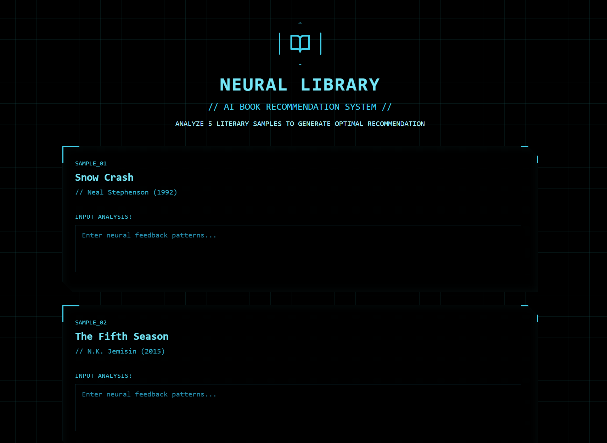

## Exercise: Coding AI Interfaces

This week we'll be building on our previous coding experience to create AI-powered applications that use Claude's language processing capabilities within web interfaces. This gets to the heart of the current AI-hype cycle - AI is being added to everything - but it also lets us think about how this technology changes our interactions with web applications in fundamental ways. The key difference this week is that instead of building rule-based systems (like our previous recommendation engine that counted ratings), you'll be building applications that use AI to interpret user input and generate personalized responses. This hands over a lot of the control to the model, as Claude will still be at the center of 

### Rebuilding Your Recommendation System

Start with the same concept you developed next week - so for me, I stuck with science fiction, but didn't try to curate data with my initial prompt. Here's the first prompt I used to build [the sample AI-powered sci-fi recommender](https://claude.ai/public/artifacts/ec0218ea-f736-4881-bd33-dec7a287555a) for this week:

**"Let's build an AI app to recommend science fiction books. It should take the user's thoughts on five random books as a couple of sentences, parse that, and then recommend a different book to try."**

The keyword here is "AI app" - that indicates to Claude you want to use [the AI application development features](https://www.anthropic.com/news/claude-powered-artifacts) Anthropic has introduced. Basically, you'll be building a wrapper for Claude, and thus starting to explore methods of controlling AI towards an intention rather than just using it for outputs.

You'll be able to get results alarmingly fast here, so use at least five other prompts to refine the prototype and distinguish it from my simple application. For instance, I used a natural language processing in my demo and invited users to enter a few sentences on the random books - you might try something totally different. Also, you can ask for new designs and interface concepts. Just describe what you want as concretely as possible. Once you've completed your AI-powered application, publish it using Claude's artifact sharing feature as before. 

### Discussion

Share the link to your AI-powered application along with reflection on the development process. Here's a few questions to think about with this type of tool:

- How does building AI-powered applications differ from traditional rule-based programming?
- What assumptions does your AI reasoning make about user input or preferences (consider Noble's arguments here)?
- How might the AI's training data or limitations affect your application's recommendations or responses?
- What are the implications of embedding AI reasoning into user-facing applications?
- How does this type of "distant coding" relate to the discussions of "talking to the computer" in *Code to Joy*?

