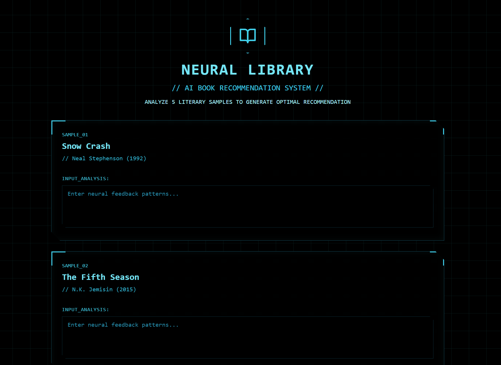

Puppet Masters

> "A complete commingling and fusion of our separate beings to create a new and unique entity." — the Puppet Master, proposing a unification with Major Kusanagi, [*Ghost in the Shell* (1995)](https://scrapsfromtheloft.com/movies/ghost-in-the-shell-1995-transcript/)

The Puppet Master doesn't ask Kusanagi to be absorbed or overwritten; it proposes something stranger — two systems, each incomplete on its own, becoming a third thing that is neither. That's the shape of this double week. You spent last week prompting a dataset and a recommendation site into being inside Claude's artifact viewer, fully contained, fully hers-or-his. This week that project leaves the sandbox: you rebuild it as an application that reasons over what a user actually types rather than what they click, and then you push it out through Git, GitHub, and Claude Code for the web until it's a page anyone can load. Simon Willison calls this general mode of working "vibe engineering" — not "vibe coding," where you never look at the code, but a real engineering practice built on delegating implementation to an agent while you stay responsible for what ships. Two weeks of the old syllabus have been merged into this one because the two halves are really one motion: build the thing, then let it out into the world. Twelve points, one continuous exercise, in two parts.

## Exercise: Building and Deploying an AI Recommender

**This is a double week worth 12 points**, combining what used to be two separate weeks. Part One rebuilds last week's recommender as an AI-reasoning application; Part Two deploys it — or a new version of it — to the open web using Claude Code for web and GitHub Pages. Do both parts in sequence; the discussion at the end covers the whole arc.

### Part One: Rebuilding Your Recommender as an AI App

Last week you built a rule-based recommendation site: a dataset of cyborg and AI media, a rating interface, and a scoring function that counted categories and returned the top matches. That system never "understood" anything — it just tallied numbers. This week, rebuild it (or start a fresh version of the same concept) as an application that hands the reasoning itself to Claude: instead of radio-button ratings, the user types a few sentences about what they liked or didn't, and the model parses that free text to figure out what to recommend next.

Say "AI app" explicitly in your prompt — that phrasing signals Claude to build a live wrapper around itself rather than a static site, using [Claude's AI-application development features](https://www.anthropic.com/news/claude-powered-artifacts). A prompt in this style, adapted to your own dataset from last week, might read:

**"Let's build an AI app version of my cyborg-and-AI-media recommender. Instead of rating individual titles, let the user describe in a couple of sentences what they've watched, read, or played and what they thought of it, then have the model parse that free text and recommend something else from my dataset."**

As a point of reference, here's an archived 2025 sample built the same way for a (much narrower) science-fiction-only version of this exercise, generated at the time with the then-current Sonnet 4.5 — now succeeded by Claude Sonnet 5:

Note that this old sample used a plain sci-fi book list, not the cyborg/AI-media dataset you built last week — it's here only to show what the interface layer can look like, not to hand you a topic.

Results here come alarmingly fast, so don't stop at a first draft. **Use at least five more prompts** to refine the app and make it genuinely yours rather than a copy of the example above: change how the free-text input gets parsed, ask for a different weighting scheme behind the recommendation, request a new layout or interaction pattern, or add a feature the example doesn't have (a confidence score, a "why this pick" explanation, multiple recommendations instead of one). Describe what you want as concretely as you can — the model responds far better to "add a hover state that shows the category match" than to "make it better." Once you're satisfied, publish the result with Claude's artifact sharing feature, the same way you have all semester — you'll need this working version, or the link to it, for Part Two.

### Part Two: Deploying to GitHub Pages with Claude Code for Web

An artifact link is still hosted inside Claude's own environment. This part moves your project onto the open web, under your own control, using Git and GitHub — the version-control and hosting workflow that most working programmers (and a growing number of scholars) use to share code and sites publicly. You'll do this with **Claude Code for web**, the browser-based version of Claude's coding agent, connected to a repository you own.

#### Step 1: Get a GitHub Education account

1. Go to [education.github.com](https://education.github.com/) and click "Get benefits."
2. Sign up for a GitHub account if you don't already have one, or sign in.
3. Verify your student status (student ID, transcript, or enrollment verification).
4. Wait for approval — this can take a few days, but you don't need it approved yet to do today's work.
5. Once approved, you'll also have access to GitHub Copilot, a Student Developer Pack benefit worth exploring later in the semester, though it's optional for this exercise.

#### Step 2: Create a GitHub repository

1. On GitHub.com, log in and click the green "New repository" button.
2. Give it a descriptive name — something like `cyborg-media-recommender` or a name tied to your own dataset's theme.
3. Check "Initialize with a README," and leave the other options at their defaults.
4. Click "Create repository."

#### Step 3: Connect Claude Code for web to your repository

This is the walkthrough you'll come back to in later weeks, so read it through once before starting.

1. Open **Claude Code on the web** at **claude.ai/code** and sign in with your class Claude account.
2. Connect your class **GitHub** account (use the account you made for this class, not a personal or professional one) and authorize access to the repository you just created.
3. When you're prompted for how to connect, choose the **personal access token** option and paste a fine-grained GitHub PAT, generated using the steps below.

> **A note on UI labels:** GitHub and Claude both update their interfaces over time. If the connect screen you see offers slightly different wording than described here, or only offers a GitHub App install path instead of a token field, follow whatever the on-screen equivalent is — the underlying idea (grant Claude Code scoped access to one repository) is the same either way. The token-generation steps below, on GitHub's side, don't change regardless of what Claude's connect screen looks like.

#### Step 4: Generate a fine-grained personal access token

On GitHub: click your profile photo in the upper right → **Settings** → **Developer settings** (left sidebar) → **Personal access tokens** → **Fine-grained tokens** → **Generate new token**.

Configure the token as follows:

- **Name:** something recognizable, e.g. `claude-code-eng6806`.
- **Expiration:** a bounded window — 60 to 90 days is reasonable. You'll need to regenerate it once it lapses.
- **Repository access:** choose **"Only select repositories"** and pick the one repository you made in Step 2. Never choose "All repositories" for a class project token.
- **Repository permissions:**
  - **Contents — Read and write** *(required)*: this is what lets Claude Code read your files, commit changes, create branches, and push.
  - **Metadata — Read** *(automatic)*: GitHub adds this by itself whenever any other repository permission is granted; you don't need to set it manually.
  - **Pages — Read and write** *(optional)*: only needed if you want the token itself to create or deploy your Pages site programmatically. For the flow below — where you enable Pages yourself through GitHub's Settings UI — you can leave this off.
  - **Administration:** **not required.** You'll turn on GitHub Pages yourself in Step 6, through the repository's own Settings page, so Claude Code's token doesn't need administrative access at all.

**Minimum viable set for this exercise:** Contents (Read and write) + Metadata (Read), scoped to your single class repo, with Pages enabled through the Settings UI in Step 6. Only add Pages (Read and write) if you specifically want Claude Code to manage Pages deployment for you.

Generate the token, copy it immediately — GitHub shows it to you exactly once — and paste it into the personal-access-token field in Claude Code for web from Step 3.

#### Step 5: Build and push with Claude Code

1. With the repository connected, describe what you want built. A good approach: ask for the JSON dataset first (you can reuse the one from last week, or a refined version), then ask for the HTML, JavaScript, and CSS separately, so you end up with several smaller files that are easier to iterate on than one giant artifact.
2. Turning on notifications is worth doing here, since you can hand off a task and go do something else while Claude works.
3. Claude Code will typically commit its work to a branch and open a pull request rather than pushing straight to `main`. Go to your repository on GitHub.com, review the pull request, and merge it once you're happy with the result.

#### Step 6: Enable GitHub Pages

1. On your repository on GitHub.com, click the **Settings** tab.
2. In the left sidebar, find **Pages**.
3. Under **Source**, choose **"Deploy from a branch."**
4. Set **Branch** to `main` and **Folder** to `/ (root)`.
5. Click **Save**.
6. GitHub will display your site's URL once it finishes building (this can take a minute or two — refresh the Pages settings page if it isn't there yet). Open it in a new tab to confirm it works.

If something's broken or you want changes, go back to Claude Code, describe the problem or the new feature, and repeat: review the pull request, merge it, and refresh your live site to test.

### Discussion

Share the link to your deployed GitHub Pages site (or, if you're still troubleshooting deployment, your artifact link plus a note on where the Pages process stalled) along with a reflection covering both halves of this week:

- How did handing the recommendation logic to Claude's reasoning, instead of a rule-based scoring function, change what your app is actually capable of — and what did it get worse at?
- What assumptions does your AI-reasoning app make about a user's free-text input, and where might those assumptions go wrong (consider Noble's arguments about whose language and preferences get read as "normal")?
- What was the more disorienting part of this week: giving up control of the recommendation logic to an AI app in Part One, or giving up control of the deployment pipeline — PATs, permissions, branches — to Claude Code in Part Two?
- *AI for Good*'s second chapter, "Physician Heal Thyself," is about handing consequential judgment to AI systems in a domain — healthcare — where the stakes of a wrong inference are much higher than a bad book recommendation. What does your (much lower-stakes) experience this week suggest about what it takes to trust an AI system's reasoning over your own, and where that trust should stop?
- Finally, connect this back to the epigraph. The Puppet Master doesn't propose that Kusanagi's ghost survive unchanged inside a merger, or that it simply be replaced — it proposes fusion into "a new and unique entity," something neither party was alone. Between your dataset-plus-interface and Claude's reasoning, or between you and Claude Code as you handed off the deploy pipeline, did anything like that fusion happen this week — a result neither you nor the model would have produced on your own — or does that framing overstate what's really just careful delegation, the way Willison describes "vibe engineering": staying responsible for the outcome even when you didn't write every line?
