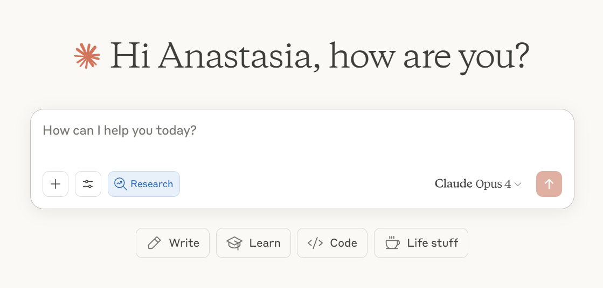

## Tutorial: Research and Sources

This week, we're going to contextualize some of the current AI "hype" surrounding research capacities and consider the implications of AI as a search engine. For this exercise, you'll use Claude's deep research capabilities to investigate a research question inspired by this week's readings, and think through the results both in terms of the current capacity of the technology and its potential future expansions (particularly in academic environments).

To contextualize the promise of such tools, consider this [press release from Anthropic](https://www.anthropic.com/news/research) when the research feature was released in April 2025:

> Research transforms how Claude finds and reasons with information. Claude operates agentically, conducting multiple searches that build on each other while determining exactly what to investigate next. It explores different angles of your question automatically and works through open questions systematically. This approach delivers thorough answers, complete with easy-to-check citations so you can trust Claude's findings.
>
> Research delivers high-quality, comprehensive answers in minutes, making it practical for the multiple research tasks you tackle throughout your workday. It's this balance of speed and quality that sets it apart.

This approach is a response to the earlier challenges of hallucinations and non-existent sources often outputted in earlier models - with access to the web, Claude's agent is effectively Googling things for you and providing a synthesis of findings.

### AI-Assisted "Deep Research"

As we've been reading in *The AI Con*, LLMs themselves operate as "synthetic text-extruding machines" - and Kirschenbaum's eassay, "Prepare for the Textpocalypse," raises further questions about the future of such text machines feeding upon themselves. These machines are already reshaping our entire information landscape, with implications for all forms of labor, particularly those involving text.

From these readings, identify a research question that interests you. Some potential areas to explore might include:

- The historical precedents for current AI workplace concerns (particularly in your own field)
- The relationship between AI hype and actual implementation in specific industries
- The impact of text generation on your field
- The economic implications of AI adoption in knowledge work
- The role of labor organizations in responding to AI implementation
- International perspectives on AI regulation and workplace protection

Don't feel limited to this list: anything that arises for you from our readings and discussions is fair game! Ideally, you want something where multiple sources will be addressing the point, especially with contention - almost guaranteed on any AI topic. Once you've identified your research question, use Claude's deep research mode to request a report.

Make sure you are using your allocation of queries to Claude Opus 4, and that you've selected "Research" mode. Your query interface should look like this screenshot, with "Research" in blue when it is active. The query will take some time to run, so be as specific in your question and goals as possible when making your initial request.

*Figure 1. Claude interface, using Opus 4 and research mode*

Throughout this process, pay attention to:

- The quality and diversity of sources Claude identifies
- How well Claude synthesizes information from multiple sources
- The accuracy of Claude's analysis when you can verify it against sources you know
- Any gaps or limitations in the research Claude produces

Be particularly wary of misinterpretation of complex sources, and note where corporate marketing or press releases are treated as authoritative.

### Discussion

After completing your AI-assisted research investigation, share your findings and reflect on the process. Your discussion post should include:

1. **Your Research Question**: Clearly state the question you investigated and why you chose it.

2. **Key Findings**: Summarize the most interesting outputs, noting which sources were most relied upon.

3. **Process Reflection**: Discuss your experience using Claude for research. What worked well? What limitations did you encounter?

4. **Critique**: Evaluate the quality and reliability of your AI-assisted research. If your job involves research, do you find these tools useful? Concerning?

5. **Connections to Readings**: Draw explicit connections between your research findings and this week's readings, particularly regarding AI hype, workplace impacts, and the "textpocalypse" concerns raised by Kirschenbaum.

 Consider how your experience with AI-assisted research reflects broader questions about the role of AI in knowledge work and the role of human expertise in research and analysis.
