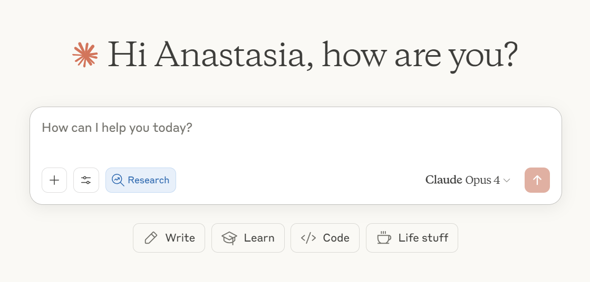

Ghosts

> “Life has become more complex in the overwhelming sea of information.” — the Puppet Master, [*Ghost in the Shell* (1995) script](https://scrapsfromtheloft.com/movies/ghost-in-the-shell-1995-transcript/)

**Slides:** [Week Three slides](slides/weekthree.html)

A quick scheduling note: Monday, September 7 is Labor Day, but this is an asynchronous course, so the module proceeds on its normal schedule — enjoy the holiday if you have it, and pick up the work whenever your week allows.

## Tutorial: Research and Sources

This week, we're going to contextualize some of the current AI "hype" surrounding research capabilities and consider the implications of AI as a search engine — or, more ambitiously, as a research assistant. For this exercise, you'll use Claude's "Research" mode to investigate a question inspired by this week's readings, and think through the results both in terms of the current capacity of the technology and its limitations (particularly in academic environments).

### AI-Assisted "Deep Research"

As we've been reading in *The AI Con*, LLMs themselves operate as "synthetic text-extruding machines" — and Kirschenbaum's essay, "Prepare for the Textpocalypse," raises further questions about the future of such text machines feeding upon themselves. These machines are already reshaping our entire information landscape, with implications for all forms of labor, particularly those involving text.

This is also a good week to sit with Karen Hao's "Inside the story that enraged OpenAI," her *MIT Technology Review* excerpt from *Empire of AI*. Hao's reporting traces the human labor, material costs, and political economy behind the "sea of information" these systems are trained on and search through — a useful corrective to keep in mind whenever a research tool hands you a tidy, confident-sounding synthesis. Her skepticism about how these companies describe their own products is a good model for how you should approach whatever Claude gives back to you this week.

Claude's Research mode works agentically: rather than returning a single search result, it runs a series of searches that build on one another, decides what to investigate next based on what it's already found, and returns a synthesized answer along with citations you can check yourself. This is meant as a response to the earlier, well-documented problem of chatbots hallucinating sources that don't exist — the citations are there so you can verify Claude's synthesis against the actual material, rather than simply trusting it. Whether that verification step actually happens is up to you as the researcher, which is exactly the point of this exercise.

From these readings, identify a research question that interests you. Some potential areas to explore might include:

- The historical precedents for current AI workplace concerns (particularly in your own field)
- The relationship between AI hype and actual implementation in specific industries
- The impact of text generation on your field
- The economic implications of AI adoption in knowledge work
- The role of labor organizations in responding to AI implementation
- International perspectives on AI regulation and workplace protection

Don't feel limited to this list: anything that arises for you from our readings and discussions is fair game! Ideally, you want something where multiple sources will be addressing the point, especially with contention — almost guaranteed on any AI topic. Once you've identified your research question, use Claude's Research mode to request a report.

Make sure you are using Claude Opus 4.8, and that you've selected "Research" mode. Your query interface should look like this screenshot, with "Research" in blue when it is active. The query will take some time to run, so be as specific in your question and goals as possible when making your initial request.

*Figure 1. Claude interface, using Opus 4.8 and Research mode*

Throughout this process, pay attention to:

- The quality and diversity of sources Claude identifies
- How well Claude synthesizes information from multiple sources
- The accuracy of Claude's analysis when you can verify it against sources you know
- Any gaps or limitations in the research Claude produces

Be particularly wary of misinterpretation of complex sources, and note where corporate marketing or press releases are treated as authoritative. Spend some time looking through the links it has collected to verify whether you agree with how the chatbot has contextualized and synthesized the response. Did it answer your question, or start to, or did it stray from your topic?

### Discussion

After reviewing the findings Claude has presented from your query, share a summary and any unexpected or interesting results back in your discussion post. Consider how this experience with AI-assisted research reflects broader questions about the role of AI in knowledge work and the role of human expertise in research and analysis. Given our discussions of labor this week, how do you feel about this approach to outsourcing a preliminary query? Was it useful? How does this compare to other ways you've worked with chatbots prior to this class?

Finally, a nod to the epigraph: when Research synthesizes an answer out of that sea of information, what did verifying (or failing to verify) its sources tell you about who is actually doing the knowing?
