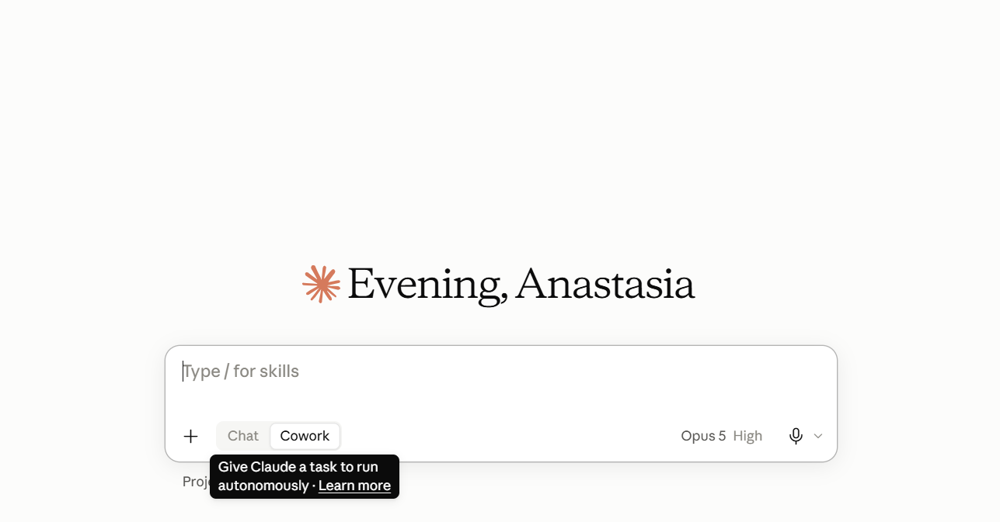
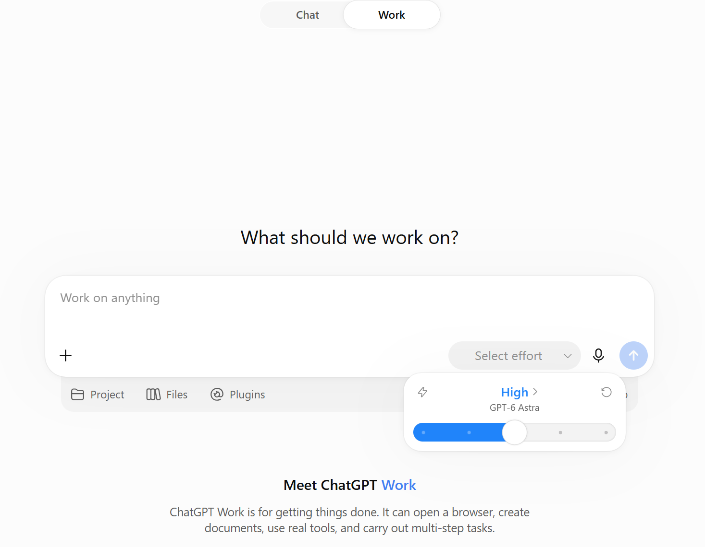

Ghosts

> “Life has become more complex in the overwhelming sea of information.” — the Puppet Master, [*Ghost in the Shell* (1995) script](https://scrapsfromtheloft.com/movies/ghost-in-the-shell-1995-transcript/)

## Tutorial: Research and Sources

This week, we're going to contextualize some of the current AI "hype" surrounding research capabilities and consider the implications of AI as a search engine — or, more ambitiously, as a research assistant. For this exercise, you'll use either Claude's Cowork or ChatGPT's Work modes to investigate a question inspired by this week's readings, and think through the results both in terms of the current capacity of the technology and its limitations (particularly in academic environments).

Note that I've added ChatGPT as an option throughout because some of you have taken my previous courses and are fairly familiar with Claude, I think the comparison could be valuable: feel free to jump back and forth or pick one.

### AI-Assisted "Deep Research"

As we've been reading in *The AI Con*, LLMs themselves operate as "synthetic text-extruding machines" — and Kirschenbaum's essay, "Prepare for the Textpocalypse," raises further questions about the future of such text machines feeding upon themselves. These machines are already reshaping our entire information landscape, with implications for all forms of labor, particularly those involving text.

This week's reading from Karen Hao, "Inside the story that enraged OpenAI," further traces the human labor, material costs, and political economy behind the "sea of information" these systems are trained on and search through — a useful corrective to keep in mind whenever a research tool hands you a tidy, confident-sounding synthesis. Her skepticism about how these companies describe their own products is a good model for how you should approach whatever Claude or ChatGPT gives back to you this week.

I've also added an optional, very new piece from last week, Steven Levy's "Who Cares if AI Is Conscious—It's Basically Alive," alongside Hao: Levy takes the models' own claims about themselves seriously in a way *The AI Con* would definitely call hype, and I would point to our discussions of *Ghost in the Shell* for context.

Both "Cowork" and "Work" have their own hype to them, but they are also a useful introduction to agentic tools. We'll be using one or the other to run a series of research queries, allowing the agent to decide what to investigate next based on what it's already found, and returns a synthesized answer along with citations you can check yourself. This is meant as a response to the earlier, well-documented problem of chatbots hallucinating sources that don't exist, but it is also a good example of the type of use case AI agents are touted for. Just as they are trained on "big" data, they handled sifting through it well.

In the context of the readings, identify a research question that interests you. Some potential areas to explore might include:

- The historical precedents for current AI workplace concerns (particularly in your own field)
- The relationship between AI hype and actual implementation in specific industries
- The impact of text generation on your field
- The economic implications of AI adoption in knowledge work
- The role of labor organizations in responding to AI implementation
- International perspectives on AI regulation and workplace protection
- The environmental impacts of AI adoption and data centers

Don't feel limited to this list: anything that arises for you from our readings and discussions is fair game! Ideally, you want something where multiple sources will be addressing the point, especially with contention — almost guaranteed on any AI topic right now.

Make sure you select "Work" or "Cowork" as shown in the screenshots, and consider using a new model at high effort if it is available to you. I recommend watching my exercise video which covers the process in detail with each model before you begin.

*Figure 1. Claude, with "Cowork" selected next to "Chat" and Opus 5 set to High effort*

*Figure 2. ChatGPT, with "Work" selected at the top and the effort slider set to High*

Throughout this process, pay attention to:

- The quality and diversity of sources 
- How well the agent synthesizes information from multiple sources
- The accuracy of the agent's analysis when you can verify it against sources you know
- Any gaps or limitations in the research produced

Be particularly wary of misinterpretation of complex sources, and note where corporate marketing or press releases are treated as authoritative. Spend some time looking through the links it has collected to verify whether you agree with how the agent has contextualized and synthesized the response. Did it answer your question, or start to, or did it stray from your topic?

### Discussion

Now that we are past drop/add and everyone is settled in, replying to your peers will count for 2 points of each discussion (1 point / reply). From this week on, don't forget to reply twice to peers for full credit! As I discuss in this week's exercise demo, please keep in mind that while everyone is here to study AI, no one wants to be on a discussion board reading replies from other people's bots.

After reviewing the findings either Claude or ChatGPT has presented from your query, share a summary and any unexpected or interesting results back in your discussion post. Include at least one screenshot from the process or documents it produced for you. Consider how this experience with AI-assisted research reflects broader questions about the role of AI in knowledge work and the role of human expertise in research and analysis. Given our discussions of labor this week, how do you feel about this approach to outsourcing a preliminary query? Was it useful? How does this compare to other ways you've worked with chatbots prior to this class?

Finally, a nod to the epigraph: when Research synthesizes an answer out of that sea of information, what did verifying (or failing to verify) its sources tell you about who is actually doing the knowing?
