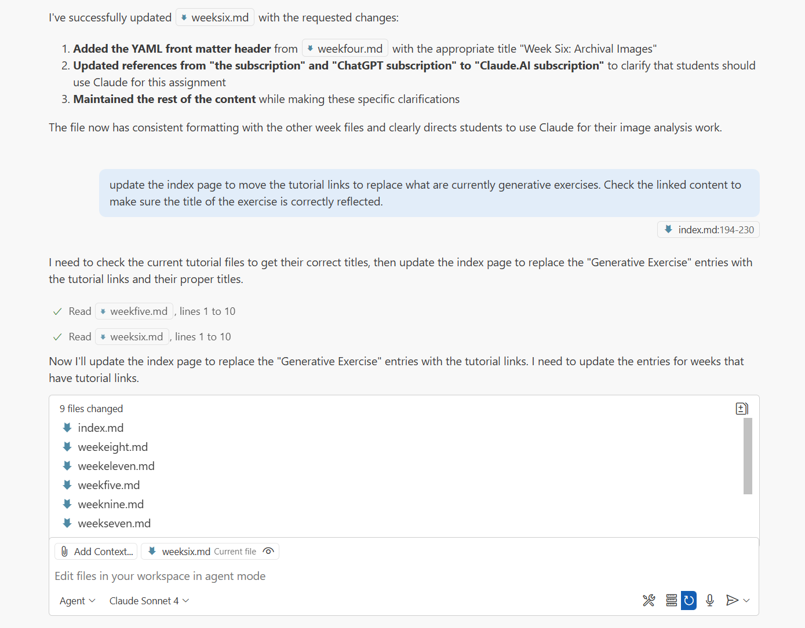

## Exercise: Agentic Code

Building on the experience you've gotten with generative code, we're now moving to engage agentic AI systems that can plan, execute, and iterate on complex coding projects. Instead of prompting for individual pieces of code and working in the artificial environment of an AI chatbot interface, you'll be working with tools that have full access to the files of a project and can make changes right on your system. For this exercise, you'll use GitHub Copilot in Agent mode along with Claude Sonnet 4 to build a complete public-facing website from scratch.

### Setting Up Your Agentic Development Environment

You should have installed the tools for this last week:

- **GitHub Copilot**: Make sure you're using Agent mode, which allows for more autonomous development assistance
- **Claude Sonnet 4**: There are several models available in the Copilot options, but this is the one I currently recommend for web coding
- **Visual Studio Code**: Make sure the GitHub Copilot extension is enabled and signed in to your educational account
- **Git/GitHub**: For version control and deployment - save a version every time you are happy with the changes, so that you can go back if the agent moves in a direction you don't want

### Building Your Public-Facing Website

Start with an empty GitHub repository and envision a public-facing website that could serve an educational purpose or function as a personal portfolio. Be ambitious - the point here is not to succeed at everything you try, the goal is to better understand what agentic systems are currently capable of producing (and where it fails). You can always use the "Undo" button to drop the most recent changes - just make sure to hit "Keep" at every iteration you want to save.

Begin by describing your vision to Claude in detail, and iterate through until you have a prototype that resembles your vision. For example:
- "I want to create an educational website about [your field of interest] that includes interactive demonstrations, animations, and user engagement features"
- "Help me plan a personal portfolio site that showcases my AI experiments with dynamic, interactive elements that demonstrate the capabilities of different AI tools"
- "Design a public humanities project website that makes [specific topic] accessible through interactive storytelling and multimedia presentations"

Use specific details, but don't worry about the content - think of this as a design exercise primarily. You might try asking for specific libraries and technologies, particularly if there are things you know or are interested in - for instance, you might ask for a D3.js data visualization, or a P5.js animation. Emphasize that the site is for deployment on GitHub pages and should stick to native web technologies (HTML, CSS, Javascript).

The design of this entire course site is an example of this - all the content is mine, but the layouts, header animation on the main page, etc. were all generated using this same process with Claude Sonnet 4. I also use Copilot to make quick updates across multiple files, as in this example chat: 

Another example is my [own website](https://anastasiasalter.net/) - the content is all from my CV and project websites, but the design was iterated with GitHub Copilot.

### Discussion

Share your deployed website link along with reflection on the agentic development process. How did you feel about your level of control? Where were the points of frustration? Would you make use of this for prototyping or managing digital projects in the future? Connect your experience to our broader course themes about AI tools, creativity, and the changing landscape of human-computer collaboration in creative and intellectual work.
