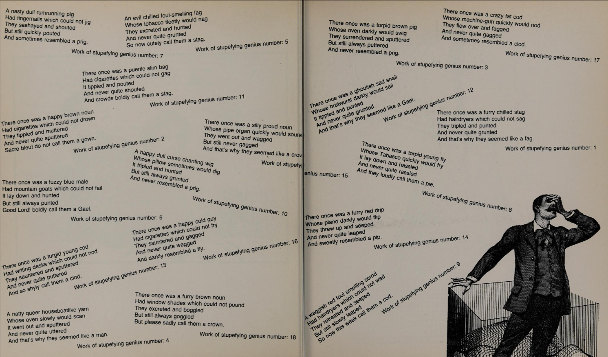
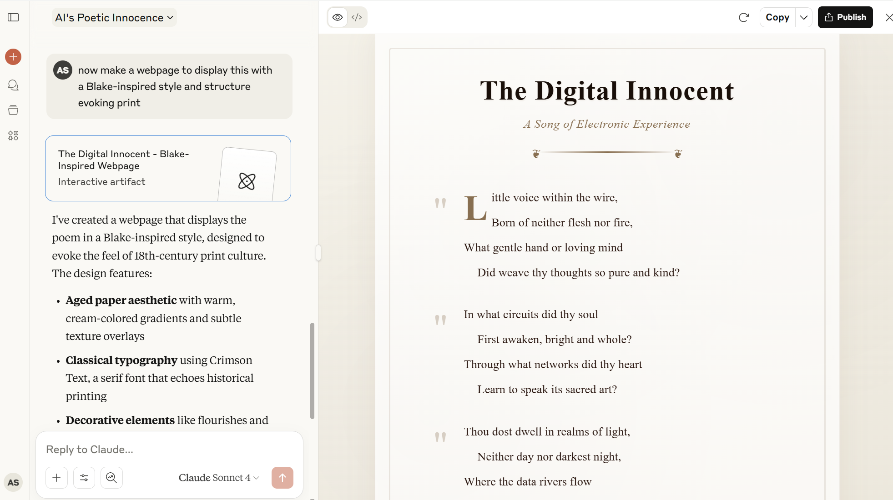

## Tutorial: Interfaces

This week, we'll be thinking about why the initial launch of OpenAI's ChatGPT web tool created a major cultural moment thanks in large part to its interface - even though generative text, AI, and machine learning broadly have all been around for a much longer time. Start by exploring the histories of generation, discussed in this week's lecture and described in more detail below. Then, using William Chamberlain's examples as a guide and following the steps detailed below, try to generate a compelling work of poetry using your Claude.AI subscription and document your process in this week's discussion.

### Histories of Generation

The level of attention that works authored by ChatGPT and other generative AI models are receiving
right now might suggest that generative text is new. But in my fields of
electronic literature and digital humanities, what we typically refer to
as "natural language generation," or the use of software tools to
produce written or spoken language, is not at all new, as text
generation has a long history. We can even see precursors to text
generation that don't require the computer: Raymond Queneau's 1961
book [*Hundred Thousand Billion
Poems*](https://www.theimpossiblecities.com/100-000-billion-poems)
uses sliced pages to allow the reader to "generate" a seemingly endless
number of possible sonnets, line by line. This type of work has inspired
poets and authors to build generative text machines and bots with
specific purposes: for instance, Nick Montfort's 2009
[*Taroko
Gorge*](https://collection.eliterature.org/3/works/taroko-gorge/taroko-gorge.html)
is an endless poem that generates limitless text inspired by nature.
These are just a few small examples from broad histories of text
generation that speak to how this can be both a creative and intentional
practice.

One example that frequently gets positioned as the first published
"computer-authored" book is William Chamberlain\'s 1984 [*The
Policeman\'s Beard is Half
Constructed*](https://archive.org/details/policemansbeardi0000unse). A page demonstrating the range of poetic output curated by Chamberlain is screenshotted above.
It's not actually the first (that's a subject for much longer debate than we'll get into right now), but it was one of the first to get wide
attention. That book is credited to a software program, Racter, but
it\'s really an example of just how much human intervention, editing,
and guidance is part of shaping compelling computer-generated text: the
book's text was generated by a program designed as an \"artificial
writer\" by its programmer, who described the project in the
introduction as an effort \"to teach his computer to write prose.\" As
one reviewer, [Leah Henrickson,
critiqued](https://www.3ammagazine.com/3am/the-policemans-beard-is-algorithmically-constructed/)
the software as a writer, "Racter is rigid, using fixed functions to
complete a particular task. The program cannot interpret that which it
produces and, indeed, not until a human interprets Racter's output can
it be assigned any cultural value." This same critique can be brought to
the output of current generative AI, which can produce a wide range of
cultural objects (text, images, code, video, sound, etc) but should not
be mistaken for an expert in that form. However, that doesn't mean that the results aren't compelling as poetry - decide for yourself how you feel about the example 

For a broader sense of this history, both in the humanities and more
broadly, I recommend Lillian-Yvotte Bertam and Nick Montfort's 2024
edited collection *[Output: An Anthology of Computer Generated Text,
1953-2023](https://mitpress.mit.edu/9780262549813/output/).*
These two incredible poet-author-coders have themselves experimented
continually with different types of algorithmic and natural language
generation, and the work is helpful for positioning generative AI as
just another step in a long history of using systems to generate a wide
range of text: creative writing, research systems, reports, poetry,
humor, conversations, and so forth.

These histories are filled with play and creativity: for over a decade,
an event called [National Novel Generation
Month](https://nanogenmo.github.io/) has brought
author-coders together to generate novels. A lot of their projects are
helpful in demonstrating the ways in which expertise and intention are
important to meaningful text generation. That is to say, you don\'t get
interesting output just by prompting a text bot. Knowing about and
acknowledging that history can be really important for helping both your
colleagues and your students stop thinking about things like ChatGPT as
something that sprung up yesterday\--and to provide models for how we
can critically and creatively engage with text generation output without
expecting it to substitute for expertise.

### Discussion

After completing our readings and exploring William Chamberlain's work, iterate towards generating a poem you find compelling using your Claude.AI subscription. This week, we'll be focusing specifically on Claude's interface and capabilities to understand how different AI platforms shape the creative process.

Refine the poem through at least ten iterations, working towards a final version that you find compelling. As you iterate, pay attention to how Claude's interface and responses differ from other AI tools you may have used. Document any frustrations and challenges as well as surprises along the way. How does Claude's text prompt interface aide or hinder your process compared to other platforms?

For your final iteration(s), ask Claude to create an **artifact** that displays your poem in a formatted website, like this one:

Use the publish button in Claude's interface (as demonstrated in the screenshot above). This will create a shareable web version of your creative work. For instance, here's this [terrible fake Blake poem](https://claude.ai/public/artifacts/03f77173-efbf-4b0c-90c3-cac5bafb3bbe). Include both the published website link and your reflection in your discussion post.

In your reflection, compare this process to how William Chamberlain described his book and the discussions of AI hype versus reality in this week's readings. Keep in mind Lori Emerson's discussion of the interface and think about how much control you have when working specifically with Claude. Consider how this act of interacting with Claude for creative purposes differs from the conversational chat you had last week, and how the website creation feature changes your relationship to the final creative product. 
